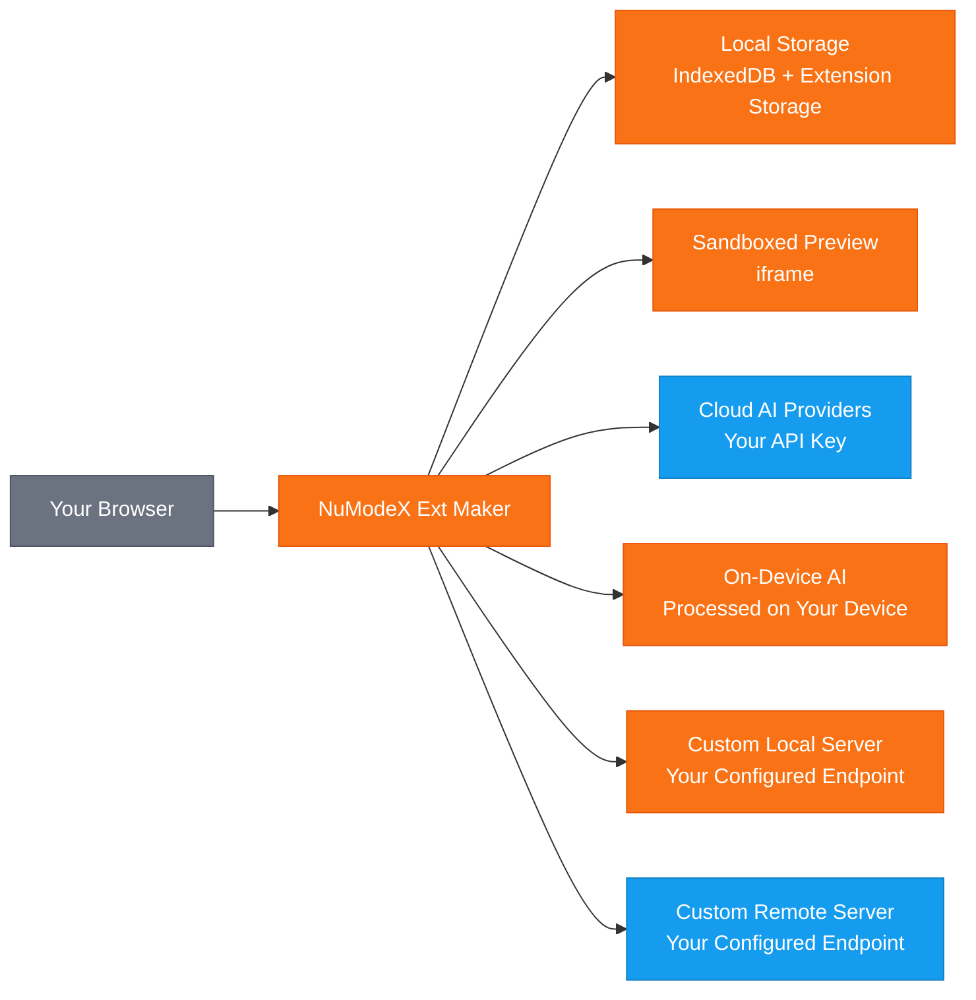

[English](README.md) | [日本語](README.ja.md) | [Español](README.es.md) | [Français](README.fr.md) | [한국어](README.ko.md) | [中文](README.zh.md) | [Português](README.pt.md) | [Italiano](README.it.md)

# NuModeX Ext Maker

 -green.svg)     

Erstellen Sie Manifest V3 Browsererweiterungen und statische Websites mit KI.

Ein Manifest V3 Browsererweiterungs- und statischer Website-Builder von SoraVantia GK. Keine Anmeldung, kein Abonnement, kein Backend. Verwenden Sie Cloud-KI-Anbieter, geräteinterne Modelle oder Ihren eigenen lokalen oder entfernten KI-Server.

**Website:** https://numodex.com/numodexextmaker

## Funktionen

- KI-gestützte Browsererweiterungsgenerierung (Manifest V3)
- Multi-Anbieter-Unterstützung. Verwenden Sie Ihren eigenen API-Schlüssel von Google, OpenAI oder Anthropic
- Geräteinterne KI-Modelle. Nutzen Sie browserbereitgestellte KI ohne API-Schlüssel
- Benutzerdefinierte Modellunterstützung. Verbinden Sie sich mit jedem lokalen oder entfernten KI-Server, der die /v1/chat/completions API unterstützt
- Konversationelle Chat-Oberfläche mit vollständigem Gesprächsverlauf
- Text- und Bild-Prompt-Unterstützung
- KI-gestütztes Bearbeiten. Bearbeiten Sie einzelne Dateien, fügen Sie neue Dateien hinzu oder verbessern Sie die gesamte Erweiterung mit einem einzigen Prompt
- Manuelle Codebearbeitung mit integriertem Editor
- Rückgängig-Unterstützung für KI-Bearbeitungen
- Änderungen anzeigen. Vergleichen Sie Vorher-Nachher-Unterschiede in einheitlicher oder nebeneinanderliegender Ansicht
- Live-Vorschau. Sehen Sie eine visuelle Vorschau Ihrer generierten Erweiterung in einem isolierten iframe
- Dateiinhalte mit einem Klick in die Zwischenablage kopieren
- Integrierter syntaxhervorgehobener Code-Viewer und Dateibaum
- Ein-Klick-ZIP-Download generierter Erweiterungen
- Mehrfachprojekt-Unterstützung. Projekte erstellen, umbenennen, wechseln und löschen
- Auto-Benennung. Projekte werden automatisch nach dem Manifest der generierten Erweiterung benannt
- Projektpersistenz. Ihre Arbeit wird automatisch gespeichert und beim erneuten Öffnen wiederhergestellt
- Tastaturkürzel. Enter zum Senden, Shift+Enter für neue Zeile, Ctrl/Cmd+Enter zum Erstellen einer Erweiterung, Ctrl/Cmd+Shift+Enter zum Erstellen einer Website
- System-Dunkelmodus-Erkennung. Passt sich beim ersten Start automatisch an Ihre OS-Einstellung an
- Dunkelmodus-Umschalter für manuelles Wechseln
- Multi-Browser-Unterstützung. Erstellen für Chrome, Edge und Firefox
- 9 Sprachen: Englisch, Japanisch, Spanisch, Französisch, Koreanisch, Chinesisch, Deutsch, Portugiesisch, Italienisch
- Integrierte Hilfeanleitung und In-App-Nutzungsbedingungen
- Kein Konto erforderlich. Läuft vollständig in Ihrem Browser
- Erstellen Sie statische Websites (HTML/CSS/JS) mit KI - gleicher chatbasierter Arbeitsablauf, andere Ausgabe
- Verfügbar für persönliche und kommerzielle Nutzung

## Datenfluss

> 🟠 Orange = bleibt auf Ihrem Gerät | 🔵 Blau = mit Ihrem API-Schlüssel übertragen | SoraVantia GK ist nicht im Datenpfad.

## Erste Schritte

1. Installieren Sie die Erweiterung aus dem Chrome Web Store (oder laden Sie sie im Entwicklermodus entpackt).
2. Klicken Sie auf Einstellungen und geben Sie Ihren API-Schlüssel Ihres Cloud-Anbieters ein. Der Schlüssel jedes Anbieters wird separat gespeichert - wechseln Sie frei zwischen Modellen.
3. Wählen Sie ein KI-Modell aus dem Dropdown-Menü.
4. Akzeptieren Sie die Nutzungsbedingungen (nur beim ersten Mal).
5. Beschreiben Sie im Chat, was Sie erstellen möchten.
6. Klicken Sie auf "Erweiterung erstellen" oder "Website erstellen" und warten Sie auf die Generierung.
7. Überprüfen und bearbeiten Sie die generierten Dateien nach Bedarf mit den integrierten Bearbeitungswerkzeugen.
8. Klicken Sie auf "Alles als ZIP herunterladen".
9. Für Erweiterungen: Entpacken Sie die ZIP-Datei, gehen Sie zu `chrome://extensions`, aktivieren Sie den Entwicklermodus und klicken Sie auf "Entpackte Erweiterung laden". Für Websites: Entpacken und `index.html` in Ihrem Browser öffnen.

> **Andere Browser:** Generierte Erweiterungen sind Manifest V3 und kompatibel mit Edge, Brave, Whale und anderen Chromium-basierten Browsern. Die Schritte zum Seitenladen variieren je nach Browser.

## Einrichtung der geräteinternen KI

Geräteinterne Modelle laufen vollständig auf Ihrer Hardware ohne API-Schlüssel oder Cloud-Verbindung. **Diese Modelle sind nur in bestimmten Browsern verfügbar:** Gemini Nano in Google Chrome und Phi-4 Mini in Microsoft Edge. Andere Chromium-basierte Browser (Brave, Whale usw.) und Firefox unterstützen derzeit keine geräteinterne KI über Browser-APIs.

**Chrome - Gemini Nano:**
1. Verwenden Sie Chrome Version 127 oder höher (Dev oder Canary für beste Ergebnisse empfohlen).
2. Gehen Sie zu `chrome://flags/#optimization-guide-on-device-model` und setzen Sie auf **Enabled BypassPerfRequirement**.
3. Gehen Sie zu `chrome://flags/#prompt-api-for-gemini-nano` und setzen Sie auf **Enabled**.
4. Starten Sie Chrome neu.
5. Gehen Sie zu `chrome://on-device-internals` und überprüfen Sie den Modellstatus. Wenn das Modell nicht heruntergeladen ist, gehen Sie zu `chrome://components/`, suchen Sie **Optimization Guide On Device Model** und klicken Sie auf **Check for update**.
6. Warten Sie, bis das Modell heruntergeladen ist. Dies kann einige Minuten dauern. Lassen Sie Chrome während des Downloads geöffnet.

**Edge - Phi-4 Mini:**
1. Verwenden Sie Edge Dev oder Canary (Version 138+). Edge 139+ enthält Phi-4 Mini standardmäßig.
2. Gehen Sie zu `edge://flags/` und suchen Sie nach **Prompt API for Phi mini**, setzen Sie auf **Enabled**.
3. Optional aktivieren Sie **Enable on device AI model debug logs** zur Fehlerbehebung.
4. Starten Sie Edge neu.
5. Gehen Sie zu `edge://on-device-internals` und überprüfen Sie, ob Ihre **Device performance class** **High** oder höher ist.
6. Das Modell wird bei der ersten Verwendung automatisch heruntergeladen. Dies kann einige Minuten dauern. Lassen Sie Edge während des Downloads geöffnet.

**Hardwareanforderungen für Edge:** Windows 10/11 oder macOS 13.3+, mindestens 20 GB freier Speicherplatz, 5,5 GB+ VRAM und eine nicht-volumenbegrenzte Internetverbindung.

**Hardwareanforderungen für Chrome:** 22 GB freier Speicherplatz, mehr als 4 GB VRAM (GPU) oder 16 GB+ RAM mit 4+ CPU-Kernen (CPU-Modus) und eine nicht-volumenbegrenzte Verbindung.

> **Hinweis:** Geräteinterne Modelle können nur für Chat und Dateibearbeitung verwendet werden. Um vollständige Erweiterungen oder Websites zu erstellen, wählen Sie ein Cloud-Modell.

## Tipps für beste Ergebnisse

- Beginnen Sie mit einer einfachen Beschreibung und bauen Sie schrittweise auf. Beschreiben Sie zuerst die Kernfunktion, dann verwenden Sie Bearbeiten und Verbessern, um weitere Funktionen schrittweise hinzuzufügen.
- Verwenden Sie ein Modell mit einem größeren Kontextfenster für komplexe Projekte. Größere Modelle verarbeiten umfangreichere Ausgaben besser als kleinere.
- Wenn Sie "Erweiterungsdateien konnten nicht extrahiert werden" sehen, war der Prompt für eine Generierung zu komplex. Vereinfachen Sie den anfänglichen Prompt und fügen Sie Funktionen durch Bearbeitung hinzu.
- Wenn Sie einen JSON-Parsing-Fehler sehen, war die Antwort des Modells zu lang und wurde abgeschnitten. Versuchen Sie einen einfacheren Prompt oder wechseln Sie zu einem Modell mit einem höheren Ausgabelimit.
- Cloud-, benutzerdefinierte und entfernte Modelle können alle zum Erstellen, Bearbeiten und Chatten verwendet werden. Wählen Sie das Modell, das am besten zu Ihren Bedürfnissen und Ihrem Budget passt.
- Geräteinterne Modelle funktionieren für Chat und Bearbeitung, können aber keine vollständigen Erweiterungen oder Websites erstellen. Verwenden Sie ein Cloud- oder benutzerdefiniertes Modell zum Erstellen.
- Enter zum Senden einer Chat-Nachricht. Shift+Enter für eine neue Zeile. Ctrl/Cmd+Enter zum Erstellen einer Erweiterung. Ctrl/Cmd+Shift+Enter zum Erstellen einer Website.
- Nach dem Erstellen verwenden Sie Datei bearbeiten für Änderungen an einzelnen Dateien und Erweiterung verbessern für Änderungen an mehreren Dateien.
- Importieren Sie vorhandene Dateien über Mehr (▾) → Dateien importieren, um sie mit KI zu bearbeiten.

## API-Schlüssel

Sie benötigen Ihren eigenen API-Schlüssel, um diese Erweiterung zu verwenden. Erhalten Sie einen von Ihrem Cloud-Anbieter. API-Schlüssel werden lokal in Ihrem Browser gespeichert und werden niemals an SoraVantia GK oder Dritte gesendet.

## Sprachen

Englisch, Japanisch, Spanisch, Französisch, Koreanisch, Chinesisch, Deutsch, Portugiesisch, Italienisch

## Lizenz

NuModeX Ext Maker ist Source-Available und unter der Business Source License 1.1 (BSL 1.1) lizenziert. Der Quellcode ist im Projekt-Repository öffentlich verfügbar.

**Business Source License 1.1** Der Quellcode ist unter der BSL 1.1 zur Nutzung verfügbar. Sie können ihn für persönliche oder interne geschäftliche Zwecke nutzen, modifizieren und abgeleitete Werke erstellen. Am 23. März 2030 wird die Lizenz automatisch in die Apache License, Version 2.0 umgewandelt. Den vollständigen Text finden Sie unter [LICENSE](LICENSE).

**Zusätzliche Nutzungsgewährung** Sie dürfen das lizenzierte Werk produktiv nutzen, sofern Ihre Nutzung nicht die Weiterverbreitung des lizenzierten Werkes (oder eines abgeleiteten Werkes) auf einem Marktplatz für Browsererweiterungen umfasst.

### Was Sie tun KÖNNEN

- Die Erweiterung für persönliche oder interne geschäftliche Zwecke nutzen
- Das Repository klonen und die Erweiterung selbst erstellen oder seitenladen
- Den Quellcode modifizieren und abgeleitete Werke für Nicht-Marktplatz-Nutzung erstellen
- Über jeden Kanal außer Marktplätzen für Browsererweiterungen verbreiten
- Den Quellcode studieren, daraus lernen und darauf verweisen
- Direkt an Benutzer seitenladen oder bereitstellen (z.B. Unternehmensbereitstellung)
- Fehler melden, Funktionen anfragen und Vorschläge über Issues senden
- Zum Originalprojekt beitragen

### Was eine Genehmigung erfordert

- Veröffentlichung im Chrome Web Store, Firefox Add-ons, Edge Add-ons, Safari Extensions, Naver Whale Store oder einem anderen Marktplatz für Browsererweiterungen

### Änderungsdatum

Am 23. März 2030 wird das lizenzierte Werk automatisch unter der Apache License, Version 2.0 verfügbar sein.

Für eine Marktplatz-Lizenz oder geschäftliche Anfragen kontaktieren Sie: numodex@soravantia.com

## Rechtliches

Durch die Installation oder Nutzung von NuModeX Ext Maker stimmen Sie der [Endbenutzer-Lizenzvereinbarung](eula-de-v2.5.md) und der [Datenschutzrichtlinie](privacy-policy-de-v2.5.md) zu.
Dieses Projekt nimmt derzeit keine Pull Requests an. Bitte verwenden Sie Issues, um Fehler zu melden und Funktionen anzufordern. Dies kann sich in Zukunft andern.

## Drittanbieter-Hinweise

NuModeX Ext Maker integriert sich mit KI-Diensten von Drittanbietern. SoraVantia GK ist mit keinem KI-Drittanbieter verbunden, wird von keinem unterstützt oder steht in offizieller Verbindung mit einem solchen. Alle Produktnamen, Marken und eingetragenen Marken sind Eigentum ihrer jeweiligen Inhaber. Ihre Erwähnung in diesem Projekt dient ausschließlich der Identifikation. SoraVantia GK kann die Unterstützung von KI-Anbietern und -Modellen jederzeit hinzufügen, entfernen oder ändern.

## Drittanbieter-Lizenzen

Siehe [THIRD-PARTY-LICENSES](THIRD-PARTY-LICENSES) für Details.

## Urheberrecht

Copyright 2026 SoraVantia GK. Alle Rechte vorbehalten.
