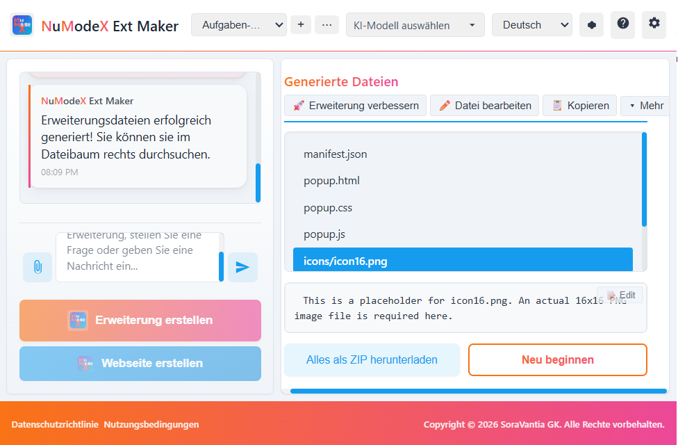
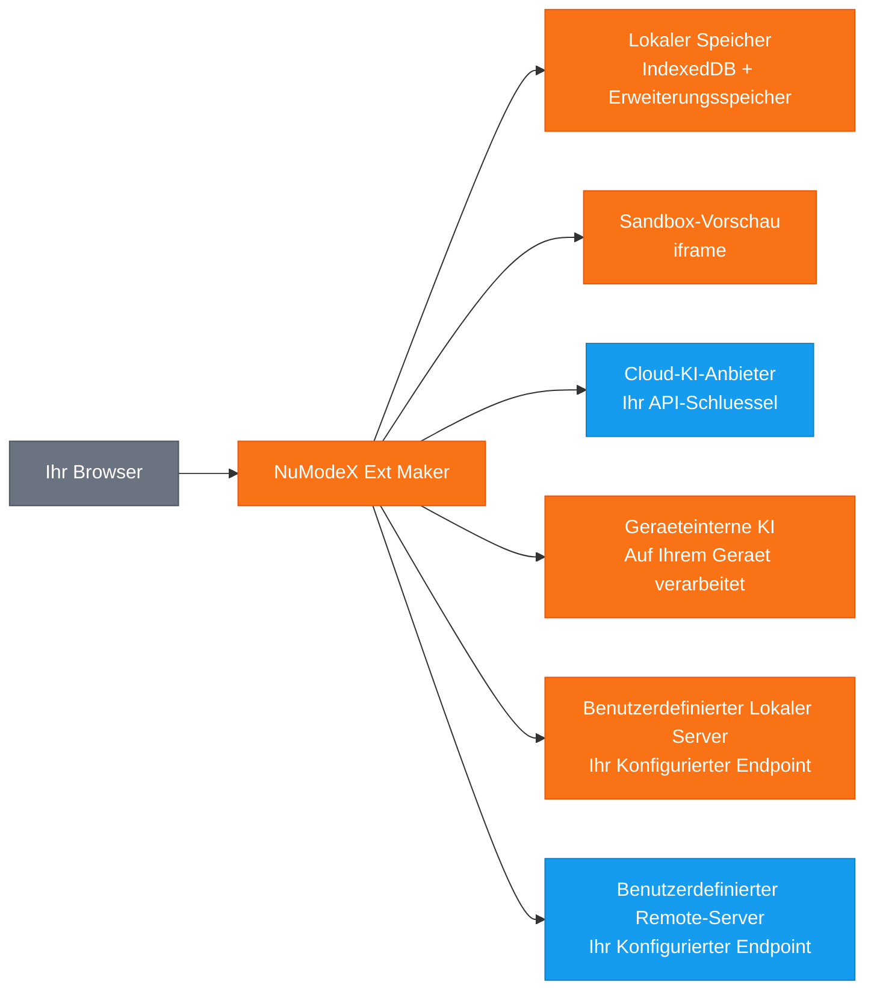

[English](README.md) | [日本語](README.ja.md) | [Español](README.es.md) | [Français](README.fr.md) | [한국어](README.ko.md) | [中文](README.zh.md) | [Português](README.pt.md) | [Italiano](README.it.md)

# NuModeX Ext Maker

 -green.svg)      

Erstellen Sie Manifest V3 Browsererweiterungen und statische Websites mit KI.

Ein Manifest V3 Browsererweiterungs- und statischer Website-Builder von SoraVantia GK. Keine Anmeldung, kein Abonnement, kein Backend. Verwenden Sie Cloud-KI-Anbieter, geräteinterne Modelle oder Ihren eigenen lokalen oder entfernten KI-Server.

**Website:** https://numodex.com/numodexextmaker

**Firefox Add-ons:** https://addons.mozilla.org/firefox/addon/numodex-ext-maker/

## Funktionen

- KI-gestützte Browsererweiterungsgenerierung (Manifest V3)
- Multi-Anbieter-Unterstützung. Verwenden Sie Ihren eigenen API-Schlüssel von Google, OpenAI oder Anthropic
- Geräteinterne KI-Modelle. Nutzen Sie browserbereitgestellte KI ohne API-Schlüssel
- Benutzerdefinierte Modellunterstützung. Verbinden Sie sich mit jedem lokalen oder entfernten KI-Server, der die /v1/chat/completions API unterstützt
- Konversationelle Chat-Oberfläche mit vollständigem Gesprächsverlauf
- Text- und Bild-Prompt-Unterstützung
- KI-gestütztes Bearbeiten. Bearbeiten Sie einzelne Dateien, fügen Sie neue Dateien hinzu oder verbessern Sie die gesamte Erweiterung mit einem einzigen Prompt
- Manuelle Codebearbeitung mit integriertem Editor
- Rückgängig-Unterstützung für KI-Bearbeitungen
- Änderungen anzeigen. Vergleichen Sie Vorher-Nachher-Unterschiede in einheitlicher oder nebeneinanderliegender Ansicht
- Live-Vorschau. Sehen Sie eine visuelle Vorschau Ihrer generierten Erweiterung in einem isolierten iframe
- Dateiinhalte mit einem Klick in die Zwischenablage kopieren
- Integrierter syntaxhervorgehobener Code-Viewer und Dateibaum
- Ein-Klick-ZIP-Download generierter Erweiterungen
- Mehrfachprojekt-Unterstützung. Projekte erstellen, umbenennen, wechseln und löschen
- Auto-Benennung. Projekte werden automatisch nach dem Manifest der generierten Erweiterung benannt
- Projektpersistenz. Ihre Arbeit wird automatisch gespeichert und beim erneuten Öffnen wiederhergestellt
- Tastaturkürzel. Enter zum Senden, Shift+Enter für neue Zeile, Ctrl/Cmd+Enter zum Erstellen einer Erweiterung, Ctrl/Cmd+Shift+Enter zum Erstellen einer Website
- System-Dunkelmodus-Erkennung. Passt sich beim ersten Start automatisch an Ihre OS-Einstellung an
- Dunkelmodus-Umschalter für manuelles Wechseln
- Multi-Browser-Unterstützung. Erstellen für Chrome, Edge und Firefox
- 9 Sprachen: Englisch, Japanisch, Spanisch, Französisch, Koreanisch, Chinesisch, Deutsch, Portugiesisch, Italienisch
- Integrierte Hilfeanleitung und In-App-Nutzungsbedingungen
- Kein Konto erforderlich. Läuft vollständig in Ihrem Browser
- Erstellen Sie statische Websites (HTML/CSS/JS) mit KI - gleicher chatbasierter Arbeitsablauf, andere Ausgabe
- Verfügbar für persönliche und kommerzielle Nutzung

## Datenfluss

> 🟠 Orange = bleibt auf Ihrem Gerät | 🔵 Blau = mit Ihrem API-Schlüssel übertragen | SoraVantia GK ist nicht im Datenpfad.

## Erste Schritte

1. Akzeptieren Sie die Nutzungsbedingungen (erster Start).
2. Geben Sie Ihren API-Schlüssel Ihres Cloud-KI-Anbieters in den Einstellungen ein.
3. Wählen Sie ein Modell, beschreiben Sie, was Sie erstellen möchten, und klicken Sie auf "Erweiterung erstellen" oder "Website erstellen".
4. Laden Sie die generierten Dateien als ZIP herunter und laden Sie sie in Ihrem Browser.

Für detaillierte Einrichtungsanweisungen, Konfiguration der geräteinternen KI, Fehlerbehebung und Tipps siehe [Erste-Schritte-Anleitung](getting-started-de-3-26-2026.md).

## API-Schlüssel

Sie benötigen Ihren eigenen API-Schlüssel, um diese Erweiterung zu verwenden. Erhalten Sie einen von Ihrem Cloud-Anbieter. API-Schlüssel werden lokal in Ihrem Browser gespeichert und werden niemals an SoraVantia GK oder Dritte gesendet.

## Sprachen

Englisch, Japanisch, Spanisch, Französisch, Koreanisch, Chinesisch, Deutsch, Portugiesisch, Italienisch

## Lizenz

NuModeX Ext Maker ist Source-Available und unter der Business Source License 1.1 (BSL 1.1) lizenziert. Der Quellcode ist im Projekt-Repository öffentlich verfügbar.

**Business Source License 1.1** Der Quellcode ist unter der BSL 1.1 zur Nutzung verfügbar. Sie können ihn für persönliche oder interne geschäftliche Zwecke nutzen, modifizieren und abgeleitete Werke erstellen. Am 23. März 2030 wird die Lizenz automatisch in die Apache License, Version 2.0 umgewandelt. Den vollständigen Text finden Sie unter [LICENSE](LICENSE).

**Zusätzliche Nutzungsgewährung** Sie dürfen das lizenzierte Werk produktiv nutzen, sofern Ihre Nutzung nicht die Weiterverbreitung des lizenzierten Werkes (oder eines abgeleiteten Werkes) auf einem Marktplatz für Browsererweiterungen umfasst.

### Was Sie tun KÖNNEN

- Die Erweiterung für persönliche oder interne geschäftliche Zwecke nutzen
- Das Repository klonen und die Erweiterung selbst erstellen oder seitenladen
- Den Quellcode modifizieren und abgeleitete Werke für Nicht-Marktplatz-Nutzung erstellen
- Über jeden Kanal außer Marktplätzen für Browsererweiterungen verbreiten
- Den Quellcode studieren, daraus lernen und darauf verweisen
- Direkt an Benutzer seitenladen oder bereitstellen (z.B. Unternehmensbereitstellung)
- Fehler melden, Funktionen anfragen und Vorschläge über Issues senden
- Zum Originalprojekt beitragen

### Was eine Genehmigung erfordert

- Veröffentlichung im Chrome Web Store, Firefox Add-ons, Edge Add-ons, Safari Extensions, Naver Whale Store oder einem anderen Marktplatz für Browsererweiterungen

### Änderungsdatum

Am 23. März 2030 wird das lizenzierte Werk automatisch unter der Apache License, Version 2.0 verfügbar sein.

Für eine Marktplatz-Lizenz oder geschäftliche Anfragen kontaktieren Sie: numodex@soravantia.com

## Rechtliches

Durch die Installation oder Nutzung von NuModeX Ext Maker stimmen Sie der [Endbenutzer-Lizenzvereinbarung](eula-de-v2.5.md) und der [Datenschutzrichtlinie](privacy-policy-de-v2.5.md) zu.
Dieses Projekt nimmt derzeit keine Pull Requests an. Bitte verwenden Sie Issues, um Fehler zu melden und Funktionen anzufordern. Dies kann sich in Zukunft andern.

## Drittanbieter-Hinweise

NuModeX Ext Maker integriert sich mit KI-Diensten von Drittanbietern. SoraVantia GK ist mit keinem KI-Drittanbieter verbunden, wird von keinem unterstützt oder steht in offizieller Verbindung mit einem solchen. Alle Produktnamen, Marken und eingetragenen Marken sind Eigentum ihrer jeweiligen Inhaber. Ihre Erwähnung in diesem Projekt dient ausschließlich der Identifikation. SoraVantia GK kann die Unterstützung von KI-Anbietern und -Modellen jederzeit hinzufügen, entfernen oder ändern.

## Drittanbieter-Lizenzen

Siehe [THIRD-PARTY-LICENSES](THIRD-PARTY-LICENSES) für Details.

## Urheberrecht

Copyright 2026 SoraVantia GK. Alle Rechte vorbehalten.
