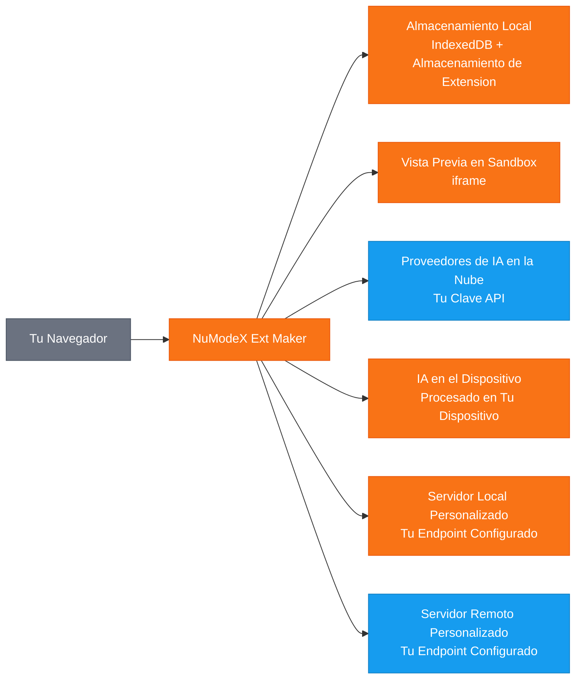

[English](README.md) | [日本語](README.ja.md) | [Français](README.fr.md) | [한국어](README.ko.md) | [中文](README.zh.md) | [Deutsch](README.de.md) | [Português](README.pt.md) | [Italiano](README.it.md)

# NuModeX Ext Maker

 -green.svg)      

Crea extensiones de navegador Manifest V3 y sitios web estaticos con IA.

Un constructor de extensiones de navegador Manifest V3 y sitios web estaticos de SoraVantia GK. Sin inicio de sesion, sin suscripcion, sin backend. Usa proveedores de IA en la nube, modelos en el dispositivo o tu propio servidor de IA local o remoto.

**Sitio web:** https://numodex.com/numodexextmaker

**Firefox Add-ons:** https://addons.mozilla.org/firefox/addon/numodex-ext-maker/

## Caracteristicas

- Generacion de extensiones de navegador con IA (Manifest V3)
- Soporte multi-proveedor. Usa tu propia clave API de Google, OpenAI o Anthropic
- Modelos de IA en el dispositivo. Usa IA proporcionada por el navegador sin necesidad de clave API
- Soporte de modelos personalizados. Conecta a cualquier servidor de IA local o remoto que soporte la API /v1/chat/completions
- Interfaz de chat conversacional con historial completo de conversacion
- Soporte de prompts de texto e imagen
- Edicion con IA. Edita archivos individuales, agrega nuevos archivos o mejora toda la extension con un solo prompt
- Edicion manual de codigo con editor en linea
- Soporte para deshacer ediciones de IA
- Ver cambios. Compara diferencias antes y despues en vista unificada o lado a lado
- Vista previa en vivo. Ve una vista previa visual de tu extension generada en un iframe aislado
- Copia el contenido de archivos al portapapeles con un clic
- Visor de codigo con resaltado de sintaxis y arbol de archivos integrado
- Descarga ZIP de extensiones generadas con un clic
- Soporte de multiples proyectos. Crea, renombra, cambia entre y elimina proyectos
- Nombrado automatico. Los proyectos se nombran automaticamente desde el manifest de la extension generada
- Persistencia de proyectos. Tu trabajo se guarda automaticamente y se restaura al reabrir
- Atajos de teclado. Enter para enviar, Shift+Enter para nueva linea, Ctrl/Cmd+Enter para construir extension, Ctrl/Cmd+Shift+Enter para construir sitio web
- Deteccion de modo oscuro del sistema. Se ajusta automaticamente a la preferencia del SO en el primer inicio
- Alternancia de modo oscuro para cambio manual
- Soporte multi-navegador. Construye para Chrome, Edge y Firefox
- 9 idiomas: ingles, japones, espanol, frances, coreano, chino, aleman, portugues, italiano
- Guia de ayuda integrada y terminos de servicio en la aplicacion
- Sin cuenta requerida. Se ejecuta completamente en tu navegador
- Construye sitios web estaticos (HTML/CSS/JS) con IA - mismo flujo de trabajo basado en chat, diferente resultado
- Disponible para uso personal y comercial

## Flujo de Datos

> 🟠 Naranja = permanece en tu dispositivo | 🔵 Azul = transmitido usando tu clave API | SoraVantia GK no esta en la ruta de datos.

## Primeros Pasos

1. Acepta los Terminos de Servicio (primer inicio).
2. Ingresa tu clave API de tu proveedor de IA en la nube en Configuracion.
3. Selecciona un modelo, describe lo que quieres y haz clic en "Construir Extension" o "Construir Sitio Web".
4. Descarga los archivos generados como ZIP y cargalos en tu navegador.

Para instrucciones detalladas de configuracion, configuracion de IA en el dispositivo, solucion de problemas y consejos, consulta la [Guia de Inicio](getting-started-es-3-26-2026.md).

## Claves API

Necesitas tu propia clave API para usar esta extension. Obten una de tu proveedor en la nube. Las claves API se almacenan localmente en tu navegador y nunca se envian a SoraVantia GK ni a terceros.

## Idiomas

Ingles, japones, espanol, frances, coreano, chino, aleman, portugues, italiano

## Licencia

NuModeX Ext Maker es source available y esta licenciado bajo la Business Source License 1.1 (BSL 1.1). El codigo fuente esta disponible publicamente en el repositorio del proyecto.

**Business Source License 1.1** El codigo fuente esta disponible para uso bajo la BSL 1.1. Puedes usar, modificar y crear obras derivadas para fines personales o comerciales internos. El 23 de marzo de 2030, la licencia se convierte automaticamente en Apache License, Version 2.0. Consulta [LICENSE](LICENSE) para el texto completo.

**Concesion de Uso Adicional** Puedes hacer uso en produccion de la Obra Licenciada, siempre que tu uso no incluya la redistribucion de la Obra Licenciada (o cualquier obra derivada) a ningun marketplace de extensiones de navegador.

### Lo que PUEDES hacer

- Usar la extension para fines personales o comerciales internos
- Clonar el repositorio y construir o cargar lateralmente la extension tu mismo
- Modificar el codigo fuente y crear obras derivadas para uso fuera de marketplaces
- Distribuir a traves de cualquier canal que no sean marketplaces de extensiones de navegador
- Estudiar, aprender y hacer referencia al codigo fuente
- Cargar lateralmente o desplegar directamente a usuarios (por ejemplo, despliegue empresarial)
- Reportar errores, solicitar funciones y enviar sugerencias a traves de Issues
- Contribuir al proyecto original

### Lo que requiere permiso

- Publicar en Chrome Web Store, Firefox Add-ons, Edge Add-ons, Safari Extensions, Naver Whale Store o cualquier marketplace de extensiones de navegador

### Fecha de Cambio

El 23 de marzo de 2030, la Obra Licenciada estara automaticamente disponible bajo la Apache License, Version 2.0.

Para una Licencia de Marketplace o consultas comerciales, contacta: numodex@soravantia.com

## Legal

Al instalar o usar NuModeX Ext Maker, aceptas el [Acuerdo de Licencia de Usuario Final](eula-es-v2.5.md) y la [Politica de Privacidad](privacy-policy-es-v2.5.md).
Este proyecto no acepta pull requests en este momento. Utilice Issues para reportar errores y solicitar funciones. Esto puede cambiar en el futuro.

## Avisos de Terceros

NuModeX Ext Maker se integra con servicios de IA de terceros. SoraVantia GK no esta afiliada, respaldada ni oficialmente conectada con ningun proveedor de IA de terceros. Todos los nombres de productos, marcas comerciales y marcas registradas son propiedad de sus respectivos titulares. Su mencion en este proyecto tiene fines de identificacion unicamente. SoraVantia GK puede agregar, eliminar o cambiar el soporte para proveedores y modelos de IA en cualquier momento.

## Licencias de Terceros

Consulta [THIRD-PARTY-LICENSES](THIRD-PARTY-LICENSES) para mas detalles.

## Derechos de Autor

Copyright 2026 SoraVantia GK. Todos los derechos reservados.
