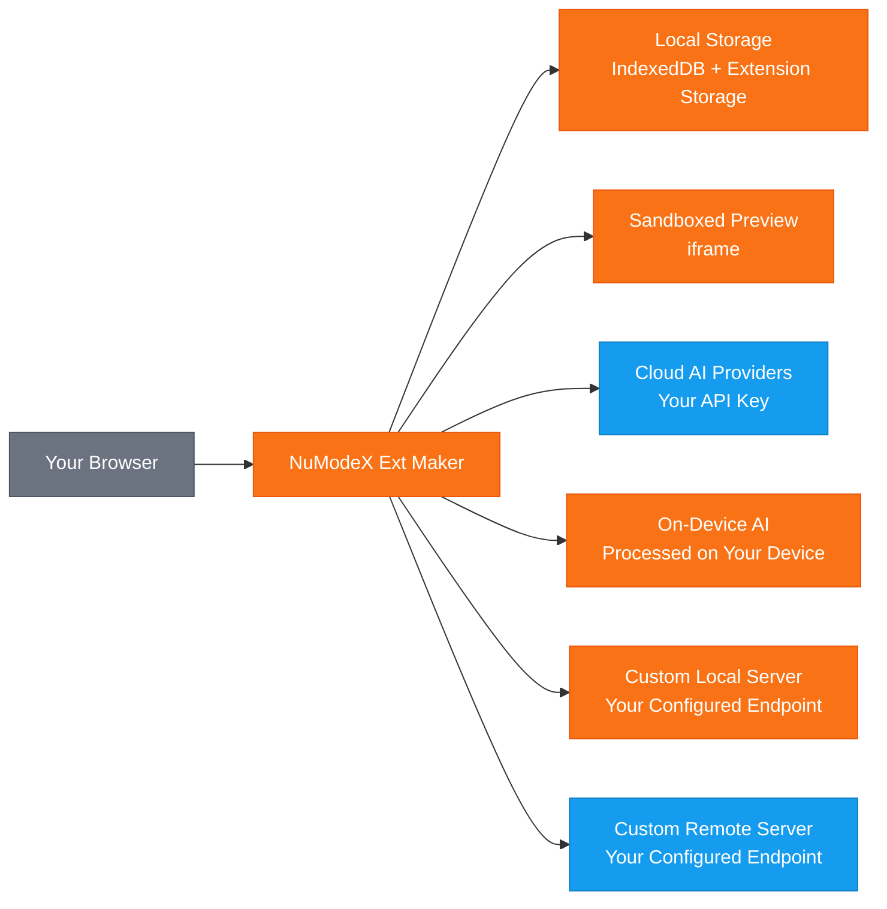

[English](README.md) | [日本語](README.ja.md) | [Español](README.es.md) | [한국어](README.ko.md) | [中文](README.zh.md) | [Deutsch](README.de.md) | [Português](README.pt.md) | [Italiano](README.it.md)

# NuModeX Ext Maker

 -green.svg)     

Creez des extensions de navigateur Manifest V3 et des sites web statiques avec l'IA.

Un constructeur d'extensions de navigateur Manifest V3 et de sites web statiques par SoraVantia GK. Sans connexion, sans abonnement, sans backend. Utilisez des fournisseurs d'IA cloud, des modeles embarques ou votre propre serveur d'IA local ou distant.

**Site web :** https://numodex.com/numodexextmaker

## Fonctionnalites

- Generation d'extensions de navigateur par IA (Manifest V3)
- Support multi-fournisseur. Utilisez votre propre cle API de Google, OpenAI ou Anthropic
- Modeles d'IA embarques. Utilisez l'IA fournie par le navigateur sans cle API requise
- Support de modeles personnalises. Connectez-vous a tout serveur d'IA local ou distant supportant l'API /v1/chat/completions
- Interface de chat conversationnelle avec historique complet des conversations
- Support de prompts texte et image
- Edition par IA. Editez des fichiers individuels, ajoutez de nouveaux fichiers ou ameliorez l'extension entiere avec un seul prompt
- Edition manuelle du code avec editeur integre
- Support d'annulation pour les modifications IA
- Affichage des modifications. Comparez les differences avant/apres en vue unifiee ou cote a cote
- Apercu en direct. Visualisez un apercu de votre extension generee dans un iframe isole
- Copiez le contenu des fichiers dans le presse-papiers en un clic
- Visionneuse de code avec coloration syntaxique et arborescence de fichiers integrees
- Telechargement ZIP des extensions generees en un clic
- Support de projets multiples. Creez, renommez, basculez entre et supprimez des projets
- Nommage automatique. Les projets sont automatiquement nommes a partir du manifest de l'extension generee
- Persistance des projets. Votre travail est sauvegarde automatiquement et restaure a la reouverture
- Raccourcis clavier. Entree pour envoyer, Maj+Entree pour nouvelle ligne, Ctrl/Cmd+Entree pour construire l'extension, Ctrl/Cmd+Maj+Entree pour construire le site web
- Detection du mode sombre systeme. S'adapte automatiquement a la preference de votre OS au premier lancement
- Bouton de basculement du mode sombre pour le changement manuel
- Support multi-navigateur. Construisez pour Chrome, Edge et Firefox
- 9 langues : anglais, japonais, espagnol, francais, coreen, chinois, allemand, portugais, italien
- Guide d'aide integre et conditions d'utilisation dans l'application
- Aucun compte requis. Fonctionne entierement dans votre navigateur
- Construisez des sites web statiques (HTML/CSS/JS) avec l'IA - meme flux de travail base sur le chat, sortie differente
- Disponible pour un usage personnel et commercial

## Flux de Donnees

> 🟠 Orange = reste sur votre appareil | 🔵 Bleu = transmis en utilisant votre cle API | SoraVantia GK n'est pas dans le chemin des donnees.

## Pour Commencer

1. Installez l'extension depuis le Chrome Web Store (ou chargez-la en mode developpeur).
2. Cliquez sur Parametres et entrez votre cle API de votre fournisseur cloud. La cle de chaque fournisseur est sauvegardee separement - changez de modele librement.
3. Selectionnez un modele d'IA dans le menu deroulant.
4. Acceptez les Conditions d'Utilisation (premiere fois uniquement).
5. Decrivez ce que vous souhaitez construire dans le chat.
6. Cliquez sur "Construire l'Extension" ou "Construire le Site Web" et attendez la generation.
7. Passez en revue et editez les fichiers generes selon vos besoins avec les outils d'edition integres.
8. Cliquez sur "Tout telecharger en ZIP".
9. Pour les extensions : Extrayez le ZIP, allez a `chrome://extensions`, activez le mode developpeur et cliquez sur "Charger l'extension non empaquetee". Pour les sites web : Extrayez et ouvrez `index.html` dans votre navigateur.

> **Autres navigateurs :** Les extensions generees sont Manifest V3 et compatibles avec Edge, Brave, Whale et d'autres navigateurs bases sur Chromium. Les etapes de chargement lateral varient selon le navigateur.

## Configuration de l'IA Embarquee

Les modeles embarques fonctionnent entierement sur votre materiel sans cle API ni connexion cloud. **Ces modeles ne sont disponibles que dans des navigateurs specifiques :** Gemini Nano dans Google Chrome et Phi-4 Mini dans Microsoft Edge. Les autres navigateurs bases sur Chromium (Brave, Whale, etc.) et Firefox ne supportent pas actuellement l'IA embarquee via les APIs du navigateur.

**Chrome - Gemini Nano :**
1. Utilisez Chrome version 127 ou superieure (Dev ou Canary recommande pour de meilleurs resultats).
2. Allez a `chrome://flags/#optimization-guide-on-device-model` et configurez sur **Enabled BypassPerfRequirement**.
3. Allez a `chrome://flags/#prompt-api-for-gemini-nano` et configurez sur **Enabled**.
4. Redemarrez Chrome.
5. Allez a `chrome://on-device-internals` et verifiez le statut du modele. Si le modele n'est pas telecharge, allez a `chrome://components/`, trouvez **Optimization Guide On Device Model** et cliquez sur **Check for update**.
6. Attendez que le modele se telecharge. Cela peut prendre plusieurs minutes. Gardez Chrome ouvert pendant le telechargement.

**Edge - Phi-4 Mini :**
1. Utilisez Edge Dev ou Canary (version 138+). Edge 139+ inclut Phi-4 Mini par defaut.
2. Allez a `edge://flags/` et recherchez **Prompt API for Phi mini**, configurez sur **Enabled**.
3. Optionnellement, activez **Enable on device AI model debug logs** pour le depannage.
4. Redemarrez Edge.
5. Allez a `edge://on-device-internals` et verifiez que votre **Device performance class** est **High** ou superieur.
6. Le modele se telecharge automatiquement lors de la premiere utilisation. Cela peut prendre plusieurs minutes. Gardez Edge ouvert pendant le telechargement.

**Configuration requise pour Edge :** Windows 10/11 ou macOS 13.3+, au moins 20 Go d'espace libre, 5,5 Go+ de VRAM et une connexion internet non limitee.

**Configuration requise pour Chrome :** 22 Go d'espace libre, plus de 4 Go de VRAM (GPU) ou 16 Go+ de RAM avec 4+ coeurs CPU (mode CPU) et une connexion non limitee.

> **Remarque :** Les modeles embarques ne peuvent etre utilises que pour le chat et l'edition de fichiers. Pour construire des extensions ou des sites web complets, selectionnez un modele cloud.

## Conseils pour de Meilleurs Resultats

- Commencez par une description simple et construisez progressivement. Decrivez d'abord la fonctionnalite principale, puis utilisez Editer et Ameliorer pour ajouter plus de fonctionnalites de maniere incrementale.
- Utilisez un modele avec une fenetre de contexte plus grande pour les projets complexes. Les modeles plus grands gerent mieux les sorties volumineuses que les plus petits.
- Si vous voyez "Impossible d'extraire les fichiers de l'extension", le prompt etait trop complexe pour une generation. Simplifiez le prompt initial et ajoutez des fonctionnalites par l'edition.
- Si vous voyez une erreur d'analyse JSON, la reponse du modele etait trop longue et a ete coupee. Essayez un prompt plus simple ou passez a un modele avec une limite de sortie plus grande.
- Les modeles cloud, personnalises et distants peuvent tous etre utilises pour construire, editer et chatter. Choisissez le modele qui correspond le mieux a vos besoins et a votre budget.
- Les modeles embarques fonctionnent pour le chat et l'edition mais ne peuvent pas construire d'extensions ou de sites web complets. Utilisez un modele cloud ou personnalise pour la construction.
- Entree pour envoyer un message de chat. Maj+Entree pour une nouvelle ligne. Ctrl/Cmd+Entree pour construire une extension. Ctrl/Cmd+Maj+Entree pour construire un site web.
- Apres la construction, utilisez Editer le Fichier pour les modifications d'un seul fichier et Ameliorer l'Extension pour les modifications sur plusieurs fichiers.
- Importez des fichiers existants via Plus (▾) → Importer des Fichiers pour les editer avec l'IA.

## Cles API

Vous avez besoin de votre propre cle API pour utiliser cette extension. Obtenez-en une aupres de votre fournisseur cloud. Les cles API sont stockees localement dans votre navigateur et ne sont jamais envoyees a SoraVantia GK ni a un tiers.

## Langues

Anglais, japonais, espagnol, francais, coreen, chinois, allemand, portugais, italien

## Licence

NuModeX Ext Maker est source available et licencie sous la Business Source License 1.1 (BSL 1.1). Le code source est disponible publiquement dans le depot du projet.

**Business Source License 1.1** Le code source est disponible sous la BSL 1.1. Vous pouvez utiliser, modifier et creer des oeuvres derivees a des fins personnelles ou professionnelles internes. Le 23 mars 2030, la licence se convertit automatiquement en Apache License, Version 2.0. Consultez [LICENSE](LICENSE) pour le texte integral.

**Concession d'Usage Supplementaire** Vous pouvez faire un usage en production de l'Oeuvre Licenciee, a condition que votre usage n'inclue pas la redistribution de l'Oeuvre Licenciee (ou de toute oeuvre derivee) sur un marketplace d'extensions de navigateur.

### Ce que vous POUVEZ faire

- Utiliser l'extension a des fins personnelles ou professionnelles internes
- Cloner le depot et construire ou charger lateralement l'extension vous-meme
- Modifier le code source et creer des oeuvres derivees pour un usage hors marketplace
- Distribuer par tout canal autre que les marketplaces d'extensions de navigateur
- Etudier, apprendre et faire reference au code source
- Charger lateralement ou deployer directement aux utilisateurs (par ex., deploiement en entreprise)
- Signaler des bugs, demander des fonctionnalites et envoyer des suggestions via Issues
- Contribuer au projet original

### Ce qui necessite une autorisation

- Publication sur Chrome Web Store, Firefox Add-ons, Edge Add-ons, Safari Extensions, Naver Whale Store ou tout marketplace d'extensions de navigateur

### Date de Changement

Le 23 mars 2030, l'Oeuvre Licenciee sera automatiquement disponible sous la Apache License, Version 2.0.

Pour une Licence de Marketplace ou pour des demandes commerciales, contactez : numodex@soravantia.com

## Mentions Legales

En installant ou en utilisant NuModeX Ext Maker, vous acceptez le [Contrat de Licence Utilisateur Final](eula-fr-v2.5.md) et la [Politique de Confidentialite](privacy-policy-fr-v2.5.md).
Ce projet n'accepte pas les pull requests pour le moment. Veuillez utiliser les Issues pour signaler des bugs et demander des fonctionnalites. Cela pourrait changer a l'avenir.

## Avis Relatifs aux Tiers

NuModeX Ext Maker s'integre a des services d'IA tiers. SoraVantia GK n'est ni affiliee, ni approuvee, ni officiellement liee a aucun fournisseur d'IA tiers. Tous les noms de produits, marques commerciales et marques deposees sont la propriete de leurs detenteurs respectifs. Leur mention dans ce projet a uniquement un but d'identification. SoraVantia GK peut ajouter, supprimer ou modifier le support de fournisseurs et modeles d'IA a tout moment.

## Licences de Tiers

Consultez [THIRD-PARTY-LICENSES](THIRD-PARTY-LICENSES) pour plus de details.

## Droits d'Auteur

Copyright 2026 SoraVantia GK. Tous droits reserves.
