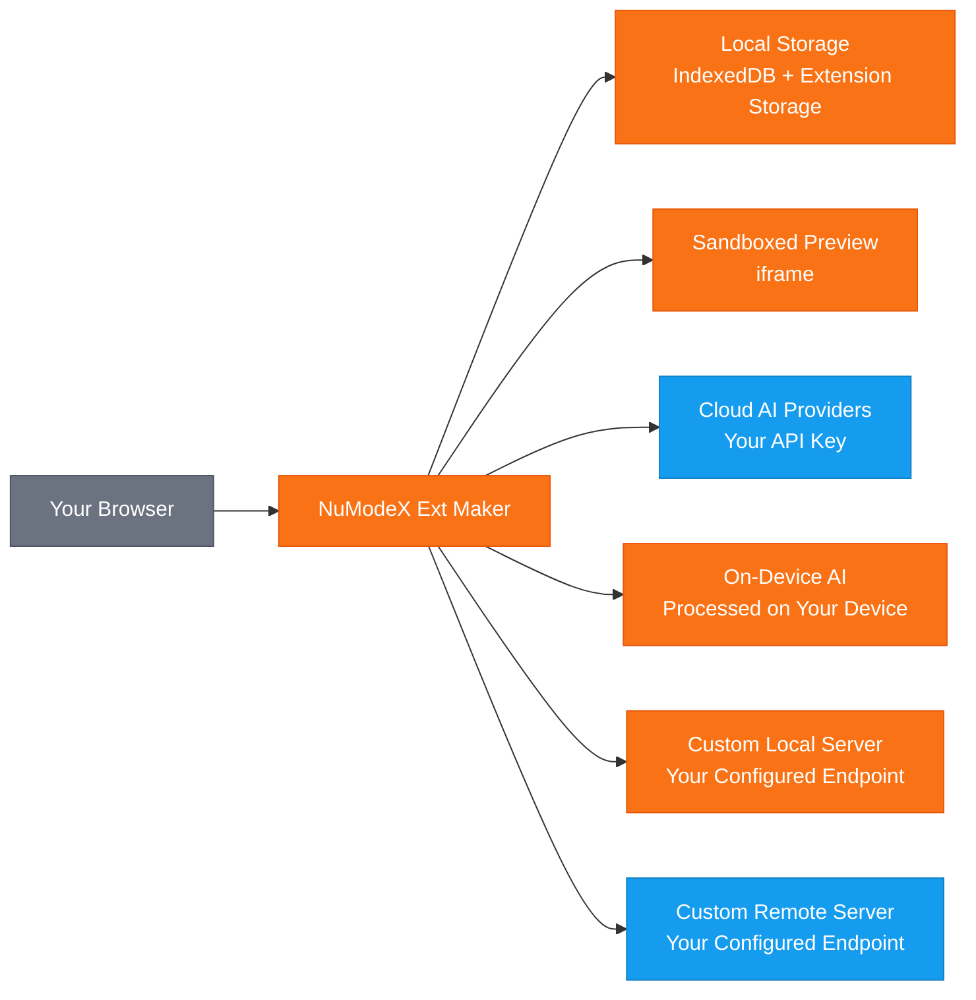

[English](README.md) | [日本語](README.ja.md) | [Español](README.es.md) | [Français](README.fr.md) | [한국어](README.ko.md) | [中文](README.zh.md) | [Deutsch](README.de.md) | [Português](README.pt.md)

# NuModeX Ext Maker

 -green.svg)     

Crea estensioni del browser Manifest V3 e siti web statici con l'IA.

Un costruttore di estensioni del browser Manifest V3 e siti web statici di SoraVantia GK. Nessun accesso, nessun abbonamento, nessun backend. Usa fornitori di IA cloud, modelli su dispositivo o il tuo server IA locale o remoto.

**Sito web:** https://numodex.com/numodexextmaker

## Funzionalita

- Generazione di estensioni del browser con IA (Manifest V3)
- Supporto multi-fornitore. Usa la tua chiave API di Google, OpenAI o Anthropic
- Modelli di IA su dispositivo. Usa l'IA fornita dal browser senza bisogno di chiave API
- Supporto modelli personalizzati. Connettiti a qualsiasi server IA locale o remoto che supporti l'API /v1/chat/completions
- Interfaccia di chat conversazionale con cronologia completa delle conversazioni
- Supporto prompt di testo e immagini
- Modifica con IA. Modifica singoli file, aggiungi nuovi file o migliora l'intera estensione con un singolo prompt
- Modifica manuale del codice con editor integrato
- Supporto annullamento per le modifiche IA
- Visualizza modifiche. Confronta le differenze prima e dopo in vista unificata o affiancata
- Anteprima dal vivo. Visualizza un'anteprima della tua estensione generata in un iframe isolato
- Copia il contenuto dei file negli appunti con un clic
- Visualizzatore di codice con evidenziazione della sintassi e albero dei file integrati
- Download ZIP delle estensioni generate con un clic
- Supporto progetti multipli. Crea, rinomina, passa da uno all'altro ed elimina progetti
- Denominazione automatica. I progetti vengono automaticamente denominati dal manifest dell'estensione generata
- Persistenza dei progetti. Il tuo lavoro viene salvato automaticamente e ripristinato alla riapertura
- Scorciatoie da tastiera. Invio per inviare, Shift+Invio per nuova riga, Ctrl/Cmd+Invio per costruire estensione, Ctrl/Cmd+Shift+Invio per costruire sito web
- Rilevamento modalita scura del sistema. Si adatta automaticamente alla preferenza del SO al primo avvio
- Interruttore modalita scura per il cambio manuale
- Supporto multi-browser. Costruisci per Chrome, Edge e Firefox
- 9 lingue: inglese, giapponese, spagnolo, francese, coreano, cinese, tedesco, portoghese, italiano
- Guida integrata e termini di servizio nell'app
- Nessun account richiesto. Funziona interamente nel tuo browser
- Costruisci siti web statici (HTML/CSS/JS) con l'IA - stesso flusso di lavoro basato su chat, output diverso
- Disponibile per uso personale e commerciale

## Flusso dei Dati

> 🟠 Arancione = rimane sul tuo dispositivo | 🔵 Blu = trasmesso usando la tua chiave API | SoraVantia GK non e nel percorso dei dati.

## Per Iniziare

1. Installa l'estensione dal Chrome Web Store (o caricala non compressa in modalita sviluppatore).
2. Clicca su Impostazioni e inserisci la tua chiave API del tuo fornitore cloud. La chiave di ogni fornitore viene salvata separatamente - cambia modello liberamente.
3. Seleziona un modello di IA dal menu a tendina.
4. Accetta i Termini di Servizio (solo la prima volta).
5. Descrivi cosa vuoi costruire nella chat.
6. Clicca su "Costruisci Estensione" o "Costruisci Sito Web" e attendi la generazione.
7. Rivedi e modifica i file generati secondo necessita usando gli strumenti di modifica integrati.
8. Clicca su "Scarica tutto come ZIP".
9. Per le estensioni: Estrai lo ZIP, vai a `chrome://extensions`, attiva la modalita sviluppatore e clicca su "Carica estensione non compressa". Per i siti web: Estrai e apri `index.html` nel tuo browser.

> **Altri browser:** Le estensioni generate sono Manifest V3 e compatibili con Edge, Brave, Whale e altri browser basati su Chromium. I passaggi per il caricamento laterale variano in base al browser.

## Configurazione dell'IA su Dispositivo

I modelli su dispositivo funzionano interamente sul tuo hardware senza bisogno di chiave API o connessione cloud. **Questi modelli sono disponibili solo in browser specifici:** Gemini Nano in Google Chrome e Phi-4 Mini in Microsoft Edge. Altri browser basati su Chromium (Brave, Whale, ecc.) e Firefox non supportano attualmente l'IA su dispositivo tramite le API del browser.

**Chrome - Gemini Nano:**
1. Usa Chrome versione 127 o superiore (Dev o Canary consigliato per i migliori risultati).
2. Vai a `chrome://flags/#optimization-guide-on-device-model` e imposta su **Enabled BypassPerfRequirement**.
3. Vai a `chrome://flags/#prompt-api-for-gemini-nano` e imposta su **Enabled**.
4. Riavvia Chrome.
5. Vai a `chrome://on-device-internals` e verifica lo stato del modello. Se il modello non e scaricato, vai a `chrome://components/`, trova **Optimization Guide On Device Model** e clicca su **Check for update**.
6. Attendi il download del modello. Potrebbe richiedere diversi minuti. Mantieni Chrome aperto durante il download.

**Edge - Phi-4 Mini:**
1. Usa Edge Dev o Canary (versione 138+). Edge 139+ include Phi-4 Mini per impostazione predefinita.
2. Vai a `edge://flags/` e cerca **Prompt API for Phi mini**, imposta su **Enabled**.
3. Facoltativamente, attiva **Enable on device AI model debug logs** per la risoluzione dei problemi.
4. Riavvia Edge.
5. Vai a `edge://on-device-internals` e verifica che la tua **Device performance class** sia **High** o superiore.
6. Il modello viene scaricato automaticamente al primo utilizzo. Potrebbe richiedere diversi minuti. Mantieni Edge aperto durante il download.

**Requisiti hardware per Edge:** Windows 10/11 o macOS 13.3+, almeno 20 GB di spazio libero, 5,5 GB+ di VRAM e una connessione internet non a consumo.

**Requisiti hardware per Chrome:** 22 GB di spazio libero, piu di 4 GB di VRAM (GPU) o 16 GB+ di RAM con 4+ core CPU (modalita CPU) e una connessione non a consumo.

> **Nota:** I modelli su dispositivo possono essere usati solo per la chat e la modifica dei file. Per costruire estensioni o siti web completi, seleziona un modello cloud.

## Consigli per i Migliori Risultati

- Inizia con una descrizione semplice e costruisci gradualmente. Descrivi prima la funzionalita principale, poi usa Modifica e Migliora per aggiungere piu funzionalita in modo incrementale.
- Usa un modello con una finestra di contesto piu grande per progetti complessi. I modelli piu grandi gestiscono output piu grandi meglio di quelli piu piccoli.
- Se vedi "Impossibile estrarre i file dell'estensione", il prompt era troppo complesso per una generazione. Semplifica il prompt iniziale e aggiungi funzionalita attraverso la modifica.
- Se vedi un errore di analisi JSON, la risposta del modello era troppo lunga ed e stata troncata. Prova un prompt piu semplice o passa a un modello con un limite di output maggiore.
- I modelli cloud, personalizzati e remoti possono tutti essere usati per costruire, modificare e chattare. Scegli il modello che meglio si adatta alle tue esigenze e al tuo budget.
- I modelli su dispositivo funzionano per la chat e la modifica ma non possono costruire estensioni o siti web completi. Usa un modello cloud o personalizzato per la costruzione.
- Invio per inviare un messaggio di chat. Shift+Invio per una nuova riga. Ctrl/Cmd+Invio per costruire un'estensione. Ctrl/Cmd+Shift+Invio per costruire un sito web.
- Dopo la costruzione, usa Modifica File per modifiche a singoli file e Migliora Estensione per modifiche su piu file.
- Importa file esistenti tramite Altro (▾) → Importa File per modificarli con l'IA.

## Chiavi API

Hai bisogno della tua chiave API per usare questa estensione. Ottienine una dal tuo fornitore cloud. Le chiavi API sono archiviate localmente nel tuo browser e non vengono mai inviate a SoraVantia GK ne a terze parti.

## Lingue

Inglese, giapponese, spagnolo, francese, coreano, cinese, tedesco, portoghese, italiano

## Licenza

NuModeX Ext Maker e source available e concesso in licenza ai sensi della Business Source License 1.1 (BSL 1.1). Il codice sorgente e disponibile pubblicamente nel repository del progetto.

**Business Source License 1.1** Il codice sorgente e disponibile per l'uso ai sensi della BSL 1.1. Puoi usare, modificare e creare opere derivate per scopi personali o aziendali interni. Il 23 marzo 2030, la licenza si converte automaticamente nella Apache License, Version 2.0. Consulta [LICENSE](LICENSE) per il testo completo.

**Concessione d'Uso Aggiuntiva** Puoi fare uso in produzione dell'Opera Licenziata, a condizione che il tuo uso non includa la ridistribuzione dell'Opera Licenziata (o di qualsiasi opera derivata) su alcun marketplace di estensioni del browser.

### Cosa PUOI fare

- Usare l'estensione per scopi personali o aziendali interni
- Clonare il repository e costruire o caricare lateralmente l'estensione
- Modificare il codice sorgente e creare opere derivate per uso non-marketplace
- Distribuire attraverso qualsiasi canale diverso dai marketplace di estensioni del browser
- Studiare, imparare e fare riferimento al codice sorgente
- Caricare lateralmente o distribuire direttamente agli utenti (ad es., distribuzione aziendale)
- Segnalare bug, richiedere funzionalita e inviare suggerimenti tramite Issues
- Contribuire al progetto originale

### Cosa richiede autorizzazione

- Pubblicazione su Chrome Web Store, Firefox Add-ons, Edge Add-ons, Safari Extensions, Naver Whale Store o qualsiasi marketplace di estensioni del browser

### Data di Modifica

Il 23 marzo 2030, l'Opera Licenziata sara automaticamente disponibile ai sensi della Apache License, Version 2.0.

Per una Licenza di Marketplace o per richieste commerciali, contattare: numodex@soravantia.com

## Note Legali

Installando o utilizzando NuModeX Ext Maker, accetti il [Contratto di Licenza per l'Utente Finale](eula-it-v2.5.md) e l'[Informativa sulla Privacy](privacy-policy-it-v2.5.md).
Questo progetto non accetta pull request al momento. Utilizzare le Issues per segnalare bug e richiedere funzionalita. Questo potrebbe cambiare in futuro.

## Avvisi su Terze Parti

NuModeX Ext Maker si integra con servizi di IA di terze parti. SoraVantia GK non e affiliata, approvata ne ufficialmente collegata ad alcun fornitore di IA di terze parti. Tutti i nomi di prodotti, marchi commerciali e marchi registrati sono di proprieta dei rispettivi titolari. La loro menzione in questo progetto ha esclusivamente scopo di identificazione. SoraVantia GK puo aggiungere, rimuovere o modificare il supporto per fornitori e modelli di IA in qualsiasi momento.

## Licenze di Terze Parti

Consulta [THIRD-PARTY-LICENSES](THIRD-PARTY-LICENSES) per i dettagli.

## Copyright

Copyright 2026 SoraVantia GK. Tutti i diritti riservati.
