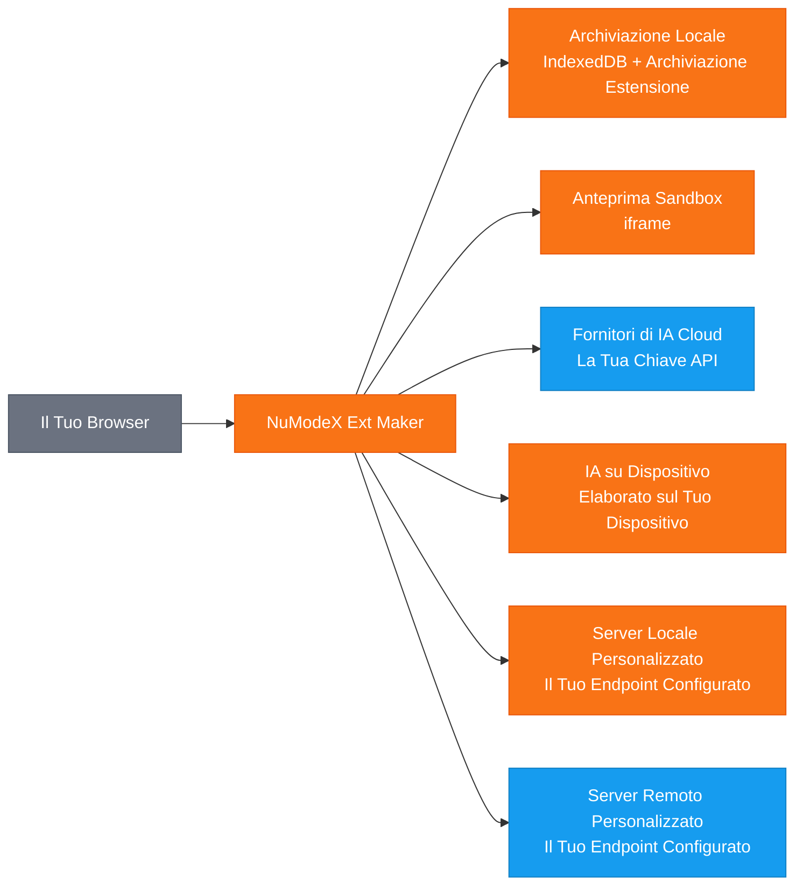

[English](README.md) | [日本語](README.ja.md) | [Español](README.es.md) | [Français](README.fr.md) | [한국어](README.ko.md) | [中文](README.zh.md) | [Deutsch](README.de.md) | [Português](README.pt.md)

# NuModeX Ext Maker

 -green.svg)      

Crea estensioni del browser Manifest V3 e siti web statici con l'IA.

Un costruttore di estensioni del browser Manifest V3 e siti web statici di SoraVantia GK. Nessun accesso, nessun abbonamento, nessun backend. Usa fornitori di IA cloud, modelli su dispositivo o il tuo server IA locale o remoto.

**Sito web:** https://numodex.com/numodexextmaker

**Firefox Add-ons:** https://addons.mozilla.org/firefox/addon/numodex-ext-maker/

## Funzionalita

- Generazione di estensioni del browser con IA (Manifest V3)
- Supporto multi-fornitore. Usa la tua chiave API di Google, OpenAI o Anthropic
- Modelli di IA su dispositivo. Usa l'IA fornita dal browser senza bisogno di chiave API
- Supporto modelli personalizzati. Connettiti a qualsiasi server IA locale o remoto che supporti l'API /v1/chat/completions
- Interfaccia di chat conversazionale con cronologia completa delle conversazioni
- Supporto prompt di testo e immagini
- Modifica con IA. Modifica singoli file, aggiungi nuovi file o migliora l'intera estensione con un singolo prompt
- Modifica manuale del codice con editor integrato
- Supporto annullamento per le modifiche IA
- Visualizza modifiche. Confronta le differenze prima e dopo in vista unificata o affiancata
- Anteprima dal vivo. Visualizza un'anteprima della tua estensione generata in un iframe isolato
- Copia il contenuto dei file negli appunti con un clic
- Visualizzatore di codice con evidenziazione della sintassi e albero dei file integrati
- Download ZIP delle estensioni generate con un clic
- Supporto progetti multipli. Crea, rinomina, passa da uno all'altro ed elimina progetti
- Denominazione automatica. I progetti vengono automaticamente denominati dal manifest dell'estensione generata
- Persistenza dei progetti. Il tuo lavoro viene salvato automaticamente e ripristinato alla riapertura
- Scorciatoie da tastiera. Invio per inviare, Shift+Invio per nuova riga, Ctrl/Cmd+Invio per costruire estensione, Ctrl/Cmd+Shift+Invio per costruire sito web
- Rilevamento modalita scura del sistema. Si adatta automaticamente alla preferenza del SO al primo avvio
- Interruttore modalita scura per il cambio manuale
- Supporto multi-browser. Costruisci per Chrome, Edge e Firefox
- 9 lingue: inglese, giapponese, spagnolo, francese, coreano, cinese, tedesco, portoghese, italiano
- Guida integrata e termini di servizio nell'app
- Nessun account richiesto. Funziona interamente nel tuo browser
- Costruisci siti web statici (HTML/CSS/JS) con l'IA - stesso flusso di lavoro basato su chat, output diverso
- Disponibile per uso personale e commerciale

## Flusso dei Dati

> 🟠 Arancione = rimane sul tuo dispositivo | 🔵 Blu = trasmesso usando la tua chiave API | SoraVantia GK non e nel percorso dei dati.

## Per Iniziare

1. Accetta i Termini di Servizio (primo avvio).
2. Inserisci la tua chiave API del tuo fornitore di IA cloud nelle Impostazioni.
3. Seleziona un modello, descrivi cosa vuoi costruire e clicca su "Costruisci Estensione" o "Costruisci Sito Web".
4. Scarica i file generati come ZIP e caricali nel tuo browser.

Per istruzioni dettagliate di configurazione, configurazione dell'IA su dispositivo, risoluzione dei problemi e consigli, consulta la [Guida Introduttiva](getting-started-it-3-26-2026.md).

## Chiavi API

Hai bisogno della tua chiave API per usare questa estensione. Ottienine una dal tuo fornitore cloud. Le chiavi API sono archiviate localmente nel tuo browser e non vengono mai inviate a SoraVantia GK ne a terze parti.

## Lingue

Inglese, giapponese, spagnolo, francese, coreano, cinese, tedesco, portoghese, italiano

## Licenza

NuModeX Ext Maker e source available e concesso in licenza ai sensi della Business Source License 1.1 (BSL 1.1). Il codice sorgente e disponibile pubblicamente nel repository del progetto.

**Business Source License 1.1** Il codice sorgente e disponibile per l'uso ai sensi della BSL 1.1. Puoi usare, modificare e creare opere derivate per scopi personali o aziendali interni. Il 23 marzo 2030, la licenza si converte automaticamente nella Apache License, Version 2.0. Consulta [LICENSE](LICENSE) per il testo completo.

**Concessione d'Uso Aggiuntiva** Puoi fare uso in produzione dell'Opera Licenziata, a condizione che il tuo uso non includa la ridistribuzione dell'Opera Licenziata (o di qualsiasi opera derivata) su alcun marketplace di estensioni del browser.

### Cosa PUOI fare

- Usare l'estensione per scopi personali o aziendali interni
- Clonare il repository e costruire o caricare lateralmente l'estensione
- Modificare il codice sorgente e creare opere derivate per uso non-marketplace
- Distribuire attraverso qualsiasi canale diverso dai marketplace di estensioni del browser
- Studiare, imparare e fare riferimento al codice sorgente
- Caricare lateralmente o distribuire direttamente agli utenti (ad es., distribuzione aziendale)
- Segnalare bug, richiedere funzionalita e inviare suggerimenti tramite Issues
- Contribuire al progetto originale

### Cosa richiede autorizzazione

- Pubblicazione su Chrome Web Store, Firefox Add-ons, Edge Add-ons, Safari Extensions, Naver Whale Store o qualsiasi marketplace di estensioni del browser

### Data di Modifica

Il 23 marzo 2030, l'Opera Licenziata sara automaticamente disponibile ai sensi della Apache License, Version 2.0.

Per una Licenza di Marketplace o per richieste commerciali, contattare: numodex@soravantia.com

## Note Legali

Installando o utilizzando NuModeX Ext Maker, accetti il [Contratto di Licenza per l'Utente Finale](eula-it-v2.5.md) e l'[Informativa sulla Privacy](privacy-policy-it-v2.5.md).
Questo progetto non accetta pull request al momento. Utilizzare le Issues per segnalare bug e richiedere funzionalita. Questo potrebbe cambiare in futuro.

## Avvisi su Terze Parti

NuModeX Ext Maker si integra con servizi di IA di terze parti. SoraVantia GK non e affiliata, approvata ne ufficialmente collegata ad alcun fornitore di IA di terze parti. Tutti i nomi di prodotti, marchi commerciali e marchi registrati sono di proprieta dei rispettivi titolari. La loro menzione in questo progetto ha esclusivamente scopo di identificazione. SoraVantia GK puo aggiungere, rimuovere o modificare il supporto per fornitori e modelli di IA in qualsiasi momento.

## Licenze di Terze Parti

Consulta [THIRD-PARTY-LICENSES](THIRD-PARTY-LICENSES) per i dettagli.

## Copyright

Copyright 2026 SoraVantia GK. Tutti i diritti riservati.
