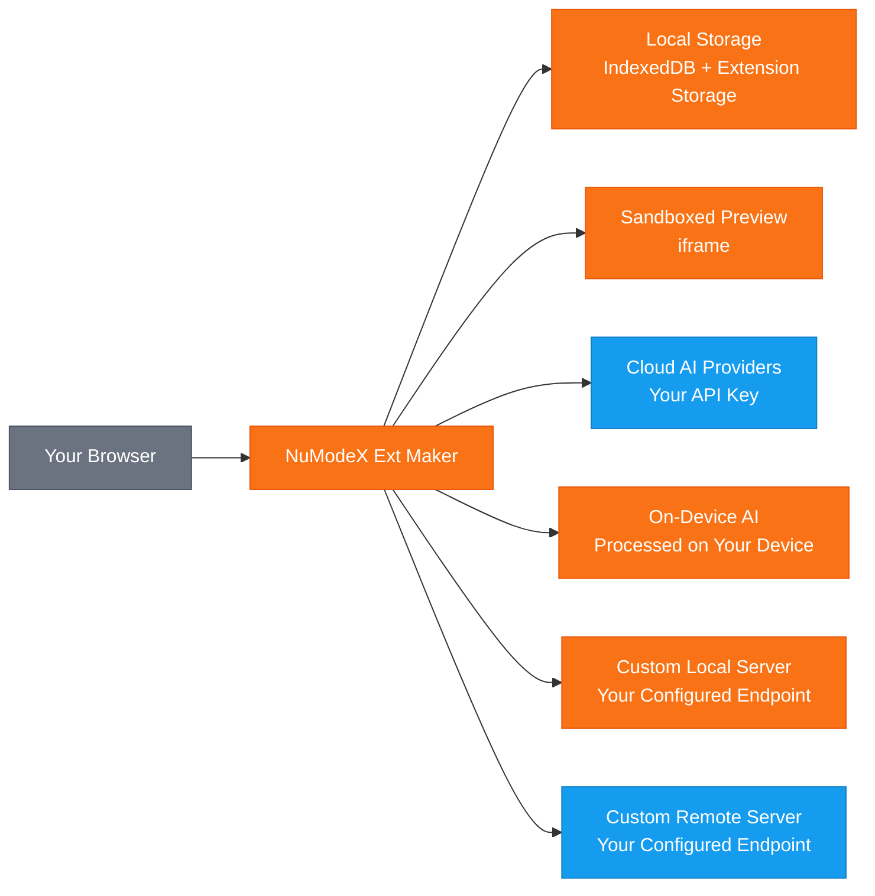

[English](README.md) | [Español](README.es.md) | [Français](README.fr.md) | [한국어](README.ko.md) | [中文](README.zh.md) | [Deutsch](README.de.md) | [Português](README.pt.md) | [Italiano](README.it.md)

# NuModeX Ext Maker

 -green.svg)     

AIでManifest V3ブラウザ拡張機能と静的ウェブサイトを構築。

SoraVantia合同会社によるManifest V3ブラウザ拡張機能・静的ウェブサイトビルダー。ログイン不要、サブスクリプション不要、バックエンド不要。クラウドAIプロバイダー、オンデバイスモデル、または独自のローカル・リモートAIサーバーを使用できます。

**ウェブサイト：** https://numodex.com/numodexextmaker

## 機能

- AI搭載のブラウザ拡張機能生成（Manifest V3）
- マルチプロバイダー対応。Google、OpenAI、またはAnthropicの自分のAPIキーを使用
- オンデバイスAIモデル。APIキー不要でブラウザ提供のAIを使用
- カスタムモデル対応。/v1/chat/completions APIをサポートする任意のローカルまたはリモートAIサーバーに接続
- 完全な会話履歴を持つ対話型チャットインターフェース
- テキストおよび画像プロンプト対応
- AI搭載の編集。個別ファイルの編集、新規ファイルの追加、または拡張機能全体の改善を1つのプロンプトで
- インラインエディターによる手動コード編集
- AI編集の元に戻す機能
- 変更の表示。統合ビューまたはサイドバイサイドビューで変更前後の差分を比較
- ライブプレビュー。サンドボックス化されたiframeで生成した拡張機能のビジュアルプレビューを表示
- ワンクリックでファイル内容をクリップボードにコピー
- 構文ハイライト付きコードビューアーとファイルツリーを内蔵
- ワンクリックで生成した拡張機能をZIPダウンロード
- 複数プロジェクト対応。プロジェクトの作成、名前変更、切り替え、削除
- 自動命名。生成した拡張機能のmanifestからプロジェクト名を自動設定
- プロジェクトの永続化。作業は自動保存され、再度開いた時に復元
- キーボードショートカット。Enterで送信、Shift+Enterで改行、Ctrl/Cmd+Enterで拡張機能をビルド、Ctrl/Cmd+Shift+Enterでウェブサイトをビルド
- システムダークモード検出。初回起動時にOS設定に自動的に合わせる
- 手動切り替え用のダークモードトグル
- マルチブラウザ対応。Chrome、Edge、Firefoxに対応
- 9言語：英語、日本語、スペイン語、フランス語、韓国語、中国語、ドイツ語、ポルトガル語、イタリア語
- ヘルプガイドとアプリ内利用規約を内蔵
- アカウント不要。完全にブラウザ内で動作
- AIで静的ウェブサイト（HTML/CSS/JS）を構築 - 同じチャットベースのワークフロー、異なる出力
- 個人および商用利用可能

## データフロー

> 🟠 オレンジ = デバイス内に留まる | 🔵 ブルー = APIキーを使用して送信 | SoraVantia合同会社はデータパスに含まれません。

## はじめに

1. Chrome Web Storeから拡張機能をインストール（またはデベロッパーモードでunpackedとしてロード）。
2. 設定をクリックし、クラウドプロバイダーのAPIキーを入力。各プロバイダーのキーは個別に保存され、自由にモデルを切り替えられます。
3. ドロップダウンからAIモデルを選択。
4. 利用規約に同意（初回のみ）。
5. チャットで構築したいものを説明。
6. 「拡張機能をビルド」または「ウェブサイトをビルド」をクリックして生成を待つ。
7. 内蔵の編集ツールを使って、必要に応じて生成されたファイルをレビュー・編集。
8. 「すべてをZIPでダウンロード」をクリック。
9. 拡張機能の場合：ZIPを展開し、`chrome://extensions`にアクセスし、デベロッパーモードを有効にして「パッケージ化されていない拡張機能を読み込む」をクリック。ウェブサイトの場合：展開して`index.html`をブラウザで開く。

> **その他のブラウザ：** 生成された拡張機能はManifest V3で、Edge、Brave、Whale、その他のChromiumベースのブラウザと互換性があります。サイドロードの手順はブラウザによって異なります。

## オンデバイスAIのセットアップ

オンデバイスモデルはAPIキーやクラウド接続なしで、完全にお使いのハードウェア上で動作します。**これらのモデルは特定のブラウザでのみ利用可能です:** Google ChromeではGemini Nano、Microsoft EdgeではPhi-4 Mini。その他のChromiumベースのブラウザ（Brave、Whaleなど）やFirefoxは、現在ブラウザAPIを通じたオンデバイスAIをサポートしていません。

**Chrome - Gemini Nano:**
1. Chromeバージョン127以上を使用（DevまたはCanaryを推奨）。
2. `chrome://flags/#optimization-guide-on-device-model` にアクセスし、**Enabled BypassPerfRequirement** に設定。
3. `chrome://flags/#prompt-api-for-gemini-nano` にアクセスし、**Enabled** に設定。
4. Chromeを再起動。
5. `chrome://on-device-internals` にアクセスしてモデルのステータスを確認。モデルがダウンロードされていない場合は、`chrome://components/` にアクセスし、**Optimization Guide On Device Model** を見つけて **Check for update** をクリック。
6. モデルのダウンロードを待つ。数分かかる場合があります。ダウンロード中はChromeを開いたままにしてください。

**Edge - Phi-4 Mini:**
1. Edge DevまたはCanary（バージョン138以上）を使用。Edge 139以降ではPhi-4 Miniがデフォルトで含まれています。
2. `edge://flags/` にアクセスし、**Prompt API for Phi mini** を検索して **Enabled** に設定。
3. オプションで **Enable on device AI model debug logs** を有効にしてトラブルシューティングに役立てる。
4. Edgeを再起動。
5. `edge://on-device-internals` にアクセスし、**Device performance class** が **High** 以上であることを確認。
6. モデルは初回使用時に自動的にダウンロードされます。数分かかる場合があります。ダウンロード中はEdgeを開いたままにしてください。

**Edgeのハードウェア要件:** Windows 10/11またはmacOS 13.3以降、20 GB以上の空き容量、5.5 GB以上のVRAM、従量制でないインターネット接続。

**Chromeのハードウェア要件:** 22 GBの空き容量、4 GB超のVRAM（GPU）または16 GB以上のRAMと4コア以上のCPU（CPUモード）、従量制でない接続。

> **注意:** オンデバイスモデルはチャットとファイル編集にのみ使用できます。拡張機能やウェブサイトの完全なビルドにはクラウドモデルを選択してください。

## より良い結果のためのヒント

- シンプルな説明から始めて徐々に構築。まずコア機能を説明し、その後「編集」と「改善」を使って段階的に機能を追加。
- 複雑なプロジェクトにはコンテキストウィンドウが大きいモデルを使用。大きなモデルは小さなモデルよりも大きな出力をうまく処理します。
- 「拡張機能ファイルを抽出できませんでした」と表示された場合、プロンプトが1回の生成には複雑すぎます。初期プロンプトをシンプルにし、編集を通じて機能を追加してください。
- JSONパースエラーが表示された場合、モデルの応答が長すぎて途中で切れています。よりシンプルなプロンプトを試すか、出力制限が大きいモデルに切り替えてください。
- クラウド、カスタム、リモートモデルはすべてビルド、編集、チャットに使用できます。ニーズと予算に最適なモデルを選択してください。
- オンデバイスモデルはチャットと編集に対応していますが、完全な拡張機能やウェブサイトのビルドはできません。ビルドにはクラウドまたはカスタムモデルを使用してください。
- Enterでチャットメッセージを送信。Shift+Enterで改行。Ctrl/Cmd+Enterで拡張機能をビルド。Ctrl/Cmd+Shift+Enterでウェブサイトをビルド。
- ビルド後、単一ファイルの変更には「ファイルを編集」、複数ファイルにまたがる変更には「拡張機能を改善」を使用。
- その他 (▾) → ファイルをインポートから既存のファイルをインポートしてAIで編集。

## APIキー

この拡張機能を使用するには自分のAPIキーが必要です。クラウドプロバイダーから取得してください。APIキーはブラウザにローカル保存され、SoraVantia合同会社や第三者に送信されることはありません。

## 言語

英語、日本語、スペイン語、フランス語、韓国語、中国語、ドイツ語、ポルトガル語、イタリア語

## ライセンス

NuModeX Ext Makerはソースアベイラブルであり、Business Source License 1.1（BSL 1.1）の下でライセンスされています。ソースコードはプロジェクトリポジトリで公開されています。

**Business Source License 1.1** ソースコードはBSL 1.1の下で利用可能です。個人または社内業務目的で使用、改変、派生著作物の作成が可能です。2030年3月23日に、ライセンスは自動的にApache License, Version 2.0に変換されます。全文は[LICENSE](LICENSE)をご覧ください。

**追加使用許可** 本ライセンス対象著作物（またはその派生著作物）をブラウザ拡張機能マーケットプレイスに再配布することを含まない限り、本番使用が可能です。

### できること

- 個人または社内業務目的での拡張機能の使用
- リポジトリのクローンと拡張機能のビルドまたはサイドロード
- マーケットプレイス以外の用途でのソースコードの改変および派生著作物の作成
- ブラウザ拡張機能マーケットプレイス以外のチャネルでの配布
- ソースコードの研究、学習、参照
- ユーザーへの直接サイドロードまたはデプロイ（例：企業内デプロイ）
- Issuesを通じたバグ報告、機能リクエスト、提案の送信
- オリジナルプロジェクトへの貢献

### 許可が必要なこと

- Chrome Web Store、Firefox Add-ons、Edge Add-ons、Safari Extensions、Naver Whale Store、またはその他のブラウザ拡張機能マーケットプレイスへの公開

### 変更日

2030年3月23日に、ライセンス対象著作物は自動的にApache License, Version 2.0の下で利用可能になります。

マーケットプレイスライセンスまたはビジネスに関するお問い合わせ：numodex@soravantia.com

## 法的事項

NuModeX Ext Makerをインストールまたは使用することにより、[エンドユーザーライセンス契約](eula-ja-v2.5.md)および[プライバシーポリシー](privacy-policy-ja-v2.5.md)に同意したものとみなされます。
本プロジェクトは現時点でプルリクエストを受け付けていません。バグ報告や機能リクエストにはIssuesをご利用ください。これは将来変更される可能性があります。

## サードパーティに関する通知

NuModeX Ext Makerはサードパーティのサービスと統合しています。SoraVantia合同会社は、いかなるサードパーティAIプロバイダーとも提携、推薦、または公式な関係を有していません。すべての製品名、商標、および登録商標はそれぞれの所有者の財産です。本プロジェクトにおけるそれらの言及は識別目的のみです。SoraVantia合同会社はAIプロバイダーおよびモデルのサポートをいつでも追加、削除、または変更することができます。

## サードパーティライセンス

詳細は[THIRD-PARTY-LICENSES](THIRD-PARTY-LICENSES)をご覧ください。

## 著作権

Copyright 2026 SoraVantia合同会社. All rights reserved.
