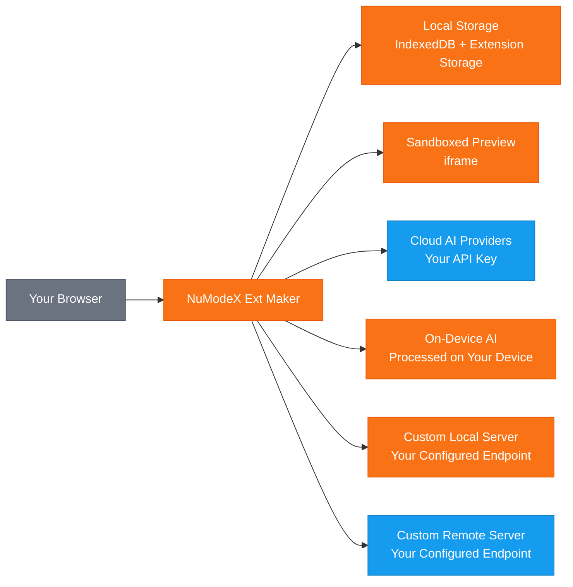

[English](README.md) | [日本語](README.ja.md) | [Español](README.es.md) | [Français](README.fr.md) | [中文](README.zh.md) | [Deutsch](README.de.md) | [Português](README.pt.md) | [Italiano](README.it.md)

# NuModeX Ext Maker

 -green.svg)     

AI로 Manifest V3 브라우저 확장 프로그램과 정적 웹사이트를 빌드하세요.

SoraVantia GK의 Manifest V3 브라우저 확장 프로그램 및 정적 웹사이트 빌더. 로그인 불필요, 구독 불필요, 백엔드 없음. 클라우드 AI 제공업체, 온디바이스 모델 또는 자체 로컬/원격 AI 서버를 사용할 수 있습니다.

**웹사이트:** https://numodex.com/numodexextmaker

## 기능

- AI 기반 브라우저 확장 프로그램 생성 (Manifest V3)
- 멀티 프로바이더 지원. Google, OpenAI 또는 Anthropic의 자체 API 키 사용
- 온디바이스 AI 모델. API 키 없이 브라우저 제공 AI 사용
- 사용자 정의 모델 지원. /v1/chat/completions API를 지원하는 로컬 또는 원격 AI 서버에 연결
- 전체 대화 기록이 포함된 대화형 채팅 인터페이스
- 텍스트 및 이미지 프롬프트 지원
- AI 기반 편집. 개별 파일 편집, 새 파일 추가 또는 단일 프롬프트로 전체 확장 프로그램 개선
- 인라인 에디터로 수동 코드 편집
- AI 편집 실행 취소 지원
- 변경 사항 보기. 통합 뷰 또는 나란히 보기에서 전후 차이 비교
- 라이브 미리보기. 샌드박스 iframe에서 생성된 확장 프로그램의 시각적 미리보기 확인
- 원클릭으로 파일 내용을 클립보드에 복사
- 구문 강조 코드 뷰어 및 파일 트리 내장
- 원클릭으로 생성된 확장 프로그램 ZIP 다운로드
- 다중 프로젝트 지원. 프로젝트 생성, 이름 변경, 전환 및 삭제
- 자동 이름 지정. 생성된 확장 프로그램의 manifest에서 프로젝트 이름 자동 설정
- 프로젝트 영속성. 작업이 자동 저장되고 다시 열 때 복원
- 키보드 단축키. Enter로 전송, Shift+Enter로 줄바꿈, Ctrl/Cmd+Enter로 확장 프로그램 빌드, Ctrl/Cmd+Shift+Enter로 웹사이트 빌드
- 시스템 다크 모드 감지. 첫 실행 시 OS 설정에 자동으로 맞춤
- 수동 전환을 위한 다크 모드 토글
- 멀티 브라우저 지원. Chrome, Edge, Firefox용 빌드
- 9개 언어: 영어, 일본어, 스페인어, 프랑스어, 한국어, 중국어, 독일어, 포르투갈어, 이탈리아어
- 내장 도움말 가이드 및 앱 내 이용약관
- 계정 불필요. 브라우저에서 완전히 실행
- AI로 정적 웹사이트(HTML/CSS/JS) 빌드 - 동일한 채팅 기반 워크플로, 다른 출력
- 개인 및 상업적 사용 가능

## 데이터 흐름

> 🟠 주황 = 디바이스에 유지 | 🔵 파랑 = API 키를 사용하여 전송 | SoraVantia GK는 데이터 경로에 포함되지 않습니다.

## 시작하기

1. Chrome Web Store에서 확장 프로그램 설치 (또는 개발자 모드에서 압축 해제된 확장 프로그램 로드).
2. 설정을 클릭하고 클라우드 제공업체의 API 키 입력. 각 제공업체의 키는 별도로 저장되어 자유롭게 모델 전환 가능.
3. 드롭다운에서 AI 모델 선택.
4. 이용약관 동의 (최초 1회만).
5. 채팅에서 빌드하려는 내용 설명.
6. "확장 프로그램 빌드" 또는 "웹사이트 빌드"를 클릭하고 생성 대기.
7. 내장 편집 도구를 사용하여 필요에 따라 생성된 파일 검토 및 편집.
8. "모두 ZIP으로 다운로드" 클릭.
9. 확장 프로그램의 경우: ZIP 압축 해제, `chrome://extensions`로 이동, 개발자 모드 활성화, "압축해제된 확장 프로그램을 로드합니다" 클릭. 웹사이트의 경우: 압축 해제 후 브라우저에서 `index.html` 열기.

> **기타 브라우저:** 생성된 확장 프로그램은 Manifest V3이며 Edge, Brave, Whale 및 기타 Chromium 기반 브라우저와 호환됩니다. 사이드로딩 단계는 브라우저마다 다릅니다.

## 온디바이스 AI 설정

온디바이스 모델은 API 키나 클라우드 연결 없이 하드웨어에서 완전히 실행됩니다. **이 모델들은 특정 브라우저에서만 사용할 수 있습니다:** Google Chrome에서는 Gemini Nano, Microsoft Edge에서는 Phi-4 Mini. 기타 Chromium 기반 브라우저(Brave, Whale 등)와 Firefox는 현재 브라우저 API를 통한 온디바이스 AI를 지원하지 않습니다.

**Chrome - Gemini Nano:**
1. Chrome 버전 127 이상 사용 (Dev 또는 Canary 권장).
2. `chrome://flags/#optimization-guide-on-device-model`로 이동하여 **Enabled BypassPerfRequirement**로 설정.
3. `chrome://flags/#prompt-api-for-gemini-nano`로 이동하여 **Enabled**로 설정.
4. Chrome 재시작.
5. `chrome://on-device-internals`로 이동하여 모델 상태 확인. 모델이 다운로드되지 않은 경우 `chrome://components/`로 이동하여 **Optimization Guide On Device Model**을 찾아 **Check for update** 클릭.
6. 모델 다운로드 완료까지 대기. 몇 분이 소요될 수 있습니다. 다운로드 중에는 Chrome을 열어 두세요.

**Edge - Phi-4 Mini:**
1. Edge Dev 또는 Canary (버전 138 이상) 사용. Edge 139 이상에는 Phi-4 Mini가 기본 포함되어 있습니다.
2. `edge://flags/`로 이동하여 **Prompt API for Phi mini**를 검색하고 **Enabled**로 설정.
3. 선택적으로 **Enable on device AI model debug logs**를 활성화하여 문제 해결에 활용.
4. Edge 재시작.
5. `edge://on-device-internals`로 이동하여 **Device performance class**가 **High** 이상인지 확인.
6. 모델은 처음 사용할 때 자동으로 다운로드됩니다. 몇 분이 소요될 수 있습니다. 다운로드 중에는 Edge를 열어 두세요.

**Edge 하드웨어 요구 사항:** Windows 10/11 또는 macOS 13.3 이상, 20 GB 이상의 여유 저장 공간, 5.5 GB 이상의 VRAM, 종량제가 아닌 인터넷 연결.

**Chrome 하드웨어 요구 사항:** 22 GB 여유 저장 공간, 4 GB 초과 VRAM (GPU) 또는 16 GB 이상 RAM 및 4코어 이상 CPU (CPU 모드), 종량제가 아닌 연결.

> **참고:** 온디바이스 모델은 채팅과 파일 편집에만 사용할 수 있습니다. 확장 프로그램이나 웹사이트의 전체 빌드에는 클라우드 모델을 선택하세요.

## 최상의 결과를 위한 팁

- 간단한 설명부터 시작하여 점진적으로 구축. 먼저 핵심 기능을 설명한 다음 편집 및 개선을 사용하여 점진적으로 기능 추가.
- 복잡한 프로젝트에는 컨텍스트 윈도우가 큰 모델 사용. 큰 모델은 작은 모델보다 큰 출력을 더 잘 처리합니다.
- "확장 프로그램 파일을 추출할 수 없습니다"가 표시되면 프롬프트가 한 번의 생성에 너무 복잡합니다. 초기 프롬프트를 단순화하고 편집을 통해 기능 추가.
- JSON 파싱 오류가 표시되면 모델의 응답이 너무 길어 잘렸습니다. 더 간단한 프롬프트를 시도하거나 출력 제한이 큰 모델로 전환.
- 클라우드, 사용자 정의, 원격 모델 모두 빌드, 편집, 채팅에 사용 가능. 필요와 예산에 가장 적합한 모델 선택.
- 온디바이스 모델은 채팅 및 편집에 작동하지만 전체 확장 프로그램이나 웹사이트를 빌드할 수 없습니다. 빌드에는 클라우드 또는 사용자 정의 모델 사용.
- Enter로 채팅 메시지 전송. Shift+Enter로 줄바꿈. Ctrl/Cmd+Enter로 확장 프로그램 빌드. Ctrl/Cmd+Shift+Enter로 웹사이트 빌드.
- 빌드 후 단일 파일 변경에는 파일 편집, 다중 파일 변경에는 확장 프로그램 개선 사용.
- 기타 (▾) → 파일 가져오기를 통해 기존 파일을 가져와서 AI로 편집.

## API 키

이 확장 프로그램을 사용하려면 자체 API 키가 필요합니다. 클라우드 제공업체에서 받으세요. API 키는 브라우저에 로컬로 저장되며 SoraVantia GK나 제3자에게 전송되지 않습니다.

## 언어

영어, 일본어, 스페인어, 프랑스어, 한국어, 중국어, 독일어, 포르투갈어, 이탈리아어

## 라이선스

NuModeX Ext Maker는 소스 공개이며 Business Source License 1.1(BSL 1.1)에 따라 라이선스됩니다. 소스 코드는 프로젝트 저장소에서 공개적으로 이용할 수 있습니다.

**Business Source License 1.1** 소스 코드는 BSL 1.1에 따라 이용 가능합니다. 개인 또는 내부 비즈니스 목적으로 사용, 수정 및 파생 저작물 생성이 가능합니다. 2030년 3월 23일에 라이선스는 자동으로 Apache License, Version 2.0으로 전환됩니다. 전문은 [LICENSE](LICENSE)를 참조하세요.

**추가 사용 허가** 라이선스 대상 저작물(또는 파생 저작물)을 브라우저 확장 프로그램 마켓플레이스에 재배포하는 것을 포함하지 않는 한, 프로덕션 사용이 가능합니다.

### 할 수 있는 것

- 개인 또는 내부 비즈니스 목적으로 확장 프로그램 사용
- 저장소를 클론하여 확장 프로그램을 직접 빌드 또는 사이드로드
- 마켓플레이스 외 용도로 소스 코드 수정 및 파생 저작물 생성
- 브라우저 확장 프로그램 마켓플레이스 외의 채널을 통한 배포
- 소스 코드 연구, 학습 및 참조
- 사용자에게 직접 사이드로드 또는 배포 (예: 기업 배포)
- Issues를 통한 버그 보고, 기능 요청 및 제안 전송
- 원본 프로젝트에 기여

### 허가가 필요한 것

- Chrome Web Store, Firefox Add-ons, Edge Add-ons, Safari Extensions, Naver Whale Store 또는 기타 브라우저 확장 프로그램 마켓플레이스에 게시

### 변경일

2030년 3월 23일에 라이선스 대상 저작물은 자동으로 Apache License, Version 2.0에 따라 이용 가능해집니다.

마켓플레이스 라이선스 또는 비즈니스 문의: numodex@soravantia.com

## 법적 사항

NuModeX Ext Maker를 설치하거나 사용함으로써 [최종 사용자 라이선스 계약](eula-ko-v2.5.md) 및 [개인정보 보호정책](privacy-policy-ko-v2.5.md)에 동의하는 것으로 간주됩니다.
본 프로젝트는 현재 풀 리퀘스트를 받지 않습니다. 버그 보고 및 기능 요청에는 Issues를 사용해 주세요. 이는 향후 변경될 수 있습니다.

## 제3자 관련 통지

NuModeX Ext Maker는 제3자 AI 서비스와 통합됩니다. SoraVantia GK는 어떤 제3자 AI 제공업체와도 제휴, 추천 또는 공식적인 관계를 맺고 있지 않습니다. 모든 제품명, 상표 및 등록 상표는 해당 소유자의 재산입니다. 본 프로젝트에서의 이러한 언급은 식별 목적으로만 사용됩니다. SoraVantia GK는 AI 제공업체 및 모델에 대한 지원을 언제든지 추가, 제거 또는 변경할 수 있습니다.

## 제3자 라이선스

자세한 내용은 [THIRD-PARTY-LICENSES](THIRD-PARTY-LICENSES)를 참조하세요.

## 저작권

Copyright 2026 SoraVantia GK. All rights reserved.
