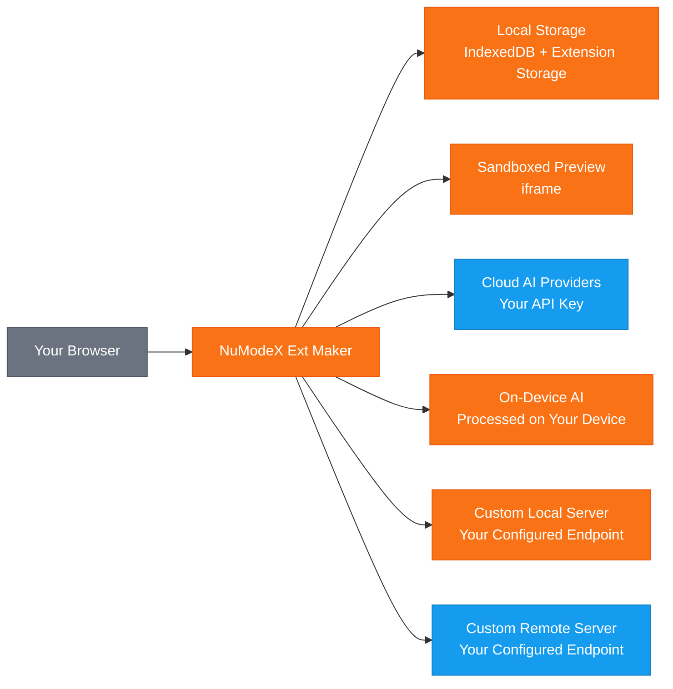

[日本語](README.ja.md) | [Español](README.es.md) | [Français](README.fr.md) | [한국어](README.ko.md) | [中文](README.zh.md) | [Deutsch](README.de.md) | [Português](README.pt.md) | [Italiano](README.it.md)

# NuModeX Ext Maker

 -green.svg)     

Build Manifest V3 browser extensions and static websites with AI.

A Manifest V3 browser extension and static website builder by SoraVantia GK. No login, no subscription, no backend. Use cloud AI providers, on-device models, or your own local or remote AI server.

**Website:** https://numodex.com/numodexextmaker

## Features

- AI-powered browser extension generation (Manifest V3)
- Multi-provider support. Bring your own API key from Google, OpenAI, or Anthropic
- On-device AI models. Use browser-provided AI with no API key required
- Custom model support. Connect to any local or remote AI server that supports the /v1/chat/completions API
- Conversational chat interface with full conversation history
- Text and image prompt support
- AI-powered editing. Edit individual files, add new files, or improve the entire extension with a single prompt
- Manual code editing with inline editor
- Undo support for AI edits
- View Changes. Compare before and after diffs in unified or side-by-side view
- Live preview. See a visual preview of your generated extension in a sandboxed iframe
- Copy file content to clipboard with one click
- Built-in syntax-highlighted code viewer and file tree
- One-click ZIP download of generated extensions
- Multiple project support. Create, rename, switch between, and delete projects
- Auto-naming. Projects are automatically named from the generated extension's manifest
- Project persistence. Your work is saved automatically and restored on reopen
- Keyboard shortcuts. Enter to send, Shift+Enter for newline, Ctrl/Cmd+Enter to Build Extension, Ctrl/Cmd+Shift+Enter to Build Website
- System dark mode detection. Automatically matches your OS preference on first launch
- Dark mode toggle for manual switching
- Multi-browser support. Build for Chrome, Edge, and Firefox
- 9 languages: English, Japanese, Spanish, French, Korean, Chinese, German, Portuguese, Italian
- Built-in help guide and in-app Terms of Service
- No account required. Runs entirely in your browser
- Build static websites (HTML/CSS/JS) with AI - same chat-based workflow, different output
- Available for personal and commercial use

## Data Flow

> 🟠 Orange = stays on your device | 🔵 Blue = transmitted using your API key | SoraVantia GK is not in the data path.

## Getting Started

1. Install the extension from Chrome Web Store (or load unpacked in developer mode).
2. Click Settings and enter your API key from your cloud provider. Each provider's key is saved separately - switch models freely.
3. Select an AI model from the dropdown.
4. Accept the Terms of Service (first time only).
5. Describe what you want to build in the chat.
6. Click "Build Extension" or "Build Website" and wait for generation.
7. Review and edit generated files as needed using the built-in editing tools.
8. Click "Download All as ZIP".
9. For extensions: Extract the ZIP, go to `chrome://extensions`, enable Developer mode, and click "Load unpacked". For websites: Extract and open `index.html` in your browser.

> **Other browsers:** Generated extensions are Manifest V3 and compatible with Edge, Brave, Whale, and other Chromium-based browsers. Sideloading steps vary by browser.

## On-Device AI Setup

On-device models run entirely on your hardware with no API key or cloud connection needed. **These models are only available in specific browsers:** Gemini Nano in Google Chrome and Phi-4 Mini in Microsoft Edge. Other Chromium-based browsers (Brave, Whale, etc.) and Firefox do not currently support on-device AI through browser APIs.

**Chrome - Gemini Nano:**
1. Use Chrome version 127 or higher (Dev or Canary recommended for best results).
2. Go to `chrome://flags/#optimization-guide-on-device-model` and set to **Enabled BypassPerfRequirement**.
3. Go to `chrome://flags/#prompt-api-for-gemini-nano` and set to **Enabled**.
4. Restart Chrome.
5. Go to `chrome://on-device-internals` and verify the model status. If the model is not downloaded, go to `chrome://components/`, find **Optimization Guide On Device Model** and click **Check for update**.
6. Wait for the model to download. This may take several minutes. Keep Chrome open during the download.

**Edge - Phi-4 Mini:**
1. Use Edge Dev or Canary (version 138+). Edge 139+ includes Phi-4 Mini by default.
2. Go to `edge://flags/` and search for **Prompt API for Phi mini**, set to **Enabled**.
3. Optionally enable **Enable on device AI model debug logs** for troubleshooting.
4. Restart Edge.
5. Go to `edge://on-device-internals` and verify your **Device performance class** is **High** or greater.
6. The model downloads automatically on first use. This may take several minutes. Keep Edge open during the download.

**Hardware requirements for Edge:** Windows 10/11 or macOS 13.3+, at least 20 GB free storage, 5.5 GB+ VRAM, and an unmetered internet connection.

**Hardware requirements for Chrome:** 22 GB free storage, more than 4 GB VRAM (GPU) or 16 GB+ RAM with 4+ CPU cores (CPU mode), and an unmetered connection.

> **Note:** On-device models can only be used for chat and file editing. To build full extensions or websites, select a cloud model.

## Tips for Best Results

- Start with a simple description and build up. Describe the core feature first, then use Edit and Improve to add more features incrementally.
- Use a model with a larger context window for complex projects. Larger models handle bigger outputs better than smaller ones.
- If you see "Could not extract extension files," the prompt was too complex for one generation. Simplify the initial prompt and add features through editing.
- If you see a JSON parsing error, the model's response was too long and got cut off. Try a simpler prompt or switch to a model with a larger output limit.
- Cloud, custom, and remote models can all be used to build, edit, and chat. Choose the model that best fits your needs and budget.
- On-device models work for chat and editing but cannot build full extensions or websites. Use a cloud or custom model for building.
- Enter to send a chat message. Shift+Enter for a new line. Ctrl/Cmd+Enter to build an extension. Ctrl/Cmd+Shift+Enter to build a website.
- After building, use Edit File for single-file changes and Improve Extension for changes across multiple files.
- Import existing files via More (▾) → Import Files to edit them with AI.

## API Keys

You need your own API key to use this extension. Get one from your cloud provider. API keys are stored locally in your browser and are never sent to SoraVantia GK or any third party.

## Languages

English, Japanese, Spanish, French, Korean, Chinese, German, Portuguese, Italian

## License

NuModeX Ext Maker is source available and licensed under the Business Source License 1.1 (BSL 1.1). The source code is publicly available in the project repository.

**Business Source License 1.1** The source code is available for use under the BSL 1.1. You may use, modify, and create derivative works for personal or internal business purposes. On March 23, 2030, the license automatically converts to the Apache License, Version 2.0. See [LICENSE](LICENSE) for the full text.

**Additional Use Grant** You may make production use of the Licensed Work, provided your use does not include redistributing the Licensed Work (or any derivative work) to any browser extension marketplace.

### What you CAN do

- Use the extension for personal or internal business purposes
- Clone the repository and build or sideload the extension yourself
- Modify the source code and create derivative works for non-marketplace use
- Distribute through any channel other than browser extension marketplaces
- Study, learn from, and reference the source code
- Sideload or deploy directly to users (e.g., enterprise deployment)
- Report bugs, request features, and send suggestions through Issues
- Contribute to the original project

### What requires permission

- Publishing to Chrome Web Store, Firefox Add-ons, Edge Add-ons, Safari Extensions, Naver Whale Store, or any browser extension marketplace

### Change Date

On March 23, 2030, the Licensed Work will automatically be available under the Apache License, Version 2.0.

For a Marketplace License or for business inquiries, contact: numodex@soravantia.com

## Legal

By installing or using NuModeX Ext Maker, you agree to the [End User License Agreement](eula-en-v2.5.md) and [Privacy Policy](privacy-policy-en-v2.5.md).
This project does not accept pull requests at this time. Please use Issues to report bugs and request features. This may change in the future.

## Third-Party Notices

NuModeX Ext Maker integrates with third-party AI services. SoraVantia GK is not affiliated with, endorsed by, or officially connected with any third-party AI provider. All product names, trademarks, and registered trademarks are the property of their respective owners. Their mention in this project is for identification purposes only. SoraVantia GK may add, remove, or change support for AI providers and models at any time.

## Third-Party Licenses

See [THIRD-PARTY-LICENSES](THIRD-PARTY-LICENSES) for details.

## Copyright

Copyright 2026 SoraVantia GK. All rights reserved.
