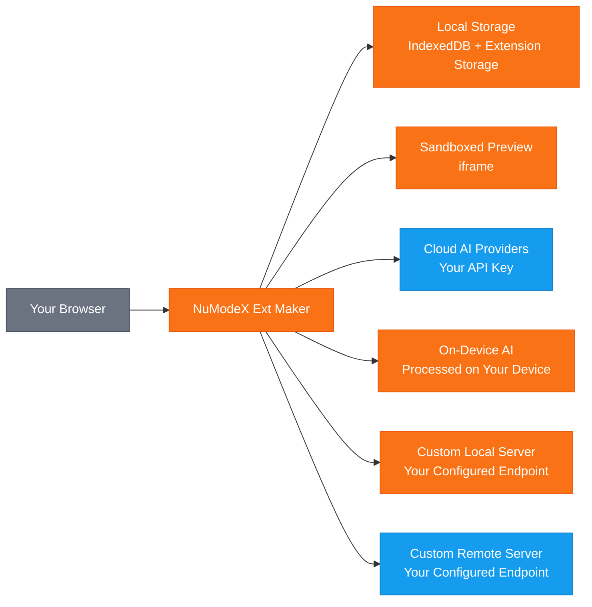

[English](README.md) | [日本語](README.ja.md) | [Español](README.es.md) | [Français](README.fr.md) | [한국어](README.ko.md) | [中文](README.zh.md) | [Deutsch](README.de.md) | [Italiano](README.it.md)

# NuModeX Ext Maker

 -green.svg)     

Crie extensoes de navegador Manifest V3 e sites estaticos com IA.

Um construtor de extensoes de navegador Manifest V3 e sites estaticos da SoraVantia GK. Sem inicio de sessao, sem subscricao, sem backend. Use fornecedores de IA na nuvem, modelos no dispositivo ou o seu proprio servidor de IA local ou remoto.

**Website:** https://numodex.com/numodexextmaker

## Funcionalidades

- Geracao de extensoes de navegador com IA (Manifest V3)
- Suporte multi-fornecedor. Use a sua propria chave API do Google, OpenAI ou Anthropic
- Modelos de IA no dispositivo. Use IA fornecida pelo navegador sem necessidade de chave API
- Suporte de modelos personalizados. Conecte-se a qualquer servidor de IA local ou remoto que suporte a API /v1/chat/completions
- Interface de chat conversacional com historico completo de conversas
- Suporte de prompts de texto e imagem
- Edicao com IA. Edite ficheiros individuais, adicione novos ficheiros ou melhore toda a extensao com um unico prompt
- Edicao manual de codigo com editor integrado
- Suporte de anulacao para edicoes de IA
- Ver alteracoes. Compare diferencas antes e depois em vista unificada ou lado a lado
- Pre-visualizacao em direto. Veja uma pre-visualizacao da sua extensao gerada num iframe isolado
- Copie o conteudo dos ficheiros para a area de transferencia com um clique
- Visualizador de codigo com realce de sintaxe e arvore de ficheiros integrados
- Download ZIP de extensoes geradas com um clique
- Suporte de multiplos projetos. Crie, renomeie, alterne entre e elimine projetos
- Nomeacao automatica. Os projetos sao automaticamente nomeados a partir do manifest da extensao gerada
- Persistencia de projetos. O seu trabalho e guardado automaticamente e restaurado ao reabrir
- Atalhos de teclado. Enter para enviar, Shift+Enter para nova linha, Ctrl/Cmd+Enter para construir extensao, Ctrl/Cmd+Shift+Enter para construir site
- Detecao de modo escuro do sistema. Ajusta-se automaticamente a preferencia do SO no primeiro lancamento
- Alternancia de modo escuro para mudanca manual
- Suporte multi-navegador. Construa para Chrome, Edge e Firefox
- 9 idiomas: ingles, japones, espanhol, frances, coreano, chines, alemao, portugues, italiano
- Guia de ajuda integrado e termos de servico na aplicacao
- Sem conta necessaria. Funciona inteiramente no seu navegador
- Construa sites estaticos (HTML/CSS/JS) com IA - mesmo fluxo de trabalho baseado em chat, resultado diferente
- Disponivel para uso pessoal e comercial

## Fluxo de Dados

> 🟠 Laranja = permanece no seu dispositivo | 🔵 Azul = transmitido usando a sua chave API | A SoraVantia GK nao esta no caminho dos dados.

## Primeiros Passos

1. Instale a extensao a partir da Chrome Web Store (ou carregue desempacotada no modo de programador).
2. Clique em Definicoes e introduza a sua chave API do seu fornecedor na nuvem. A chave de cada fornecedor e guardada separadamente - mude de modelo livremente.
3. Selecione um modelo de IA no menu suspenso.
4. Aceite os Termos de Servico (apenas na primeira vez).
5. Descreva o que pretende construir no chat.
6. Clique em "Construir Extensao" ou "Construir Site" e aguarde a geracao.
7. Reveja e edite os ficheiros gerados conforme necessario usando as ferramentas de edicao integradas.
8. Clique em "Descarregar tudo como ZIP".
9. Para extensoes: Extraia o ZIP, va a `chrome://extensions`, ative o modo de programador e clique em "Carregar extensao descompactada". Para sites: Extraia e abra `index.html` no seu navegador.

> **Outros navegadores:** As extensoes geradas sao Manifest V3 e compativeis com Edge, Brave, Whale e outros navegadores baseados em Chromium. Os passos de carregamento lateral variam consoante o navegador.

## Dicas para Melhores Resultados

- Comece com uma descricao simples e va construindo. Descreva primeiro a funcionalidade principal, depois use Editar e Melhorar para adicionar mais funcionalidades de forma incremental.
- Use um modelo com uma janela de contexto maior para projetos complexos. Modelos maiores lidam melhor com resultados maiores do que modelos menores.
- Se vir "Nao foi possivel extrair os ficheiros da extensao", o prompt era demasiado complexo para uma geracao. Simplifique o prompt inicial e adicione funcionalidades atraves da edicao.
- Se vir um erro de analise JSON, a resposta do modelo era demasiado longa e foi cortada. Tente um prompt mais simples ou mude para um modelo com um limite de saida maior.
- Modelos na nuvem, personalizados e remotos podem todos ser usados para construir, editar e conversar. Escolha o modelo que melhor se adapta as suas necessidades e orcamento.
- Modelos no dispositivo funcionam para chat e edicao mas nao conseguem construir extensoes ou sites completos. Use um modelo na nuvem ou personalizado para construir.
- Enter para enviar uma mensagem de chat. Shift+Enter para nova linha. Ctrl/Cmd+Enter para construir uma extensao. Ctrl/Cmd+Shift+Enter para construir um site.
- Apos construir, use Editar Ficheiro para alteracoes num unico ficheiro e Melhorar Extensao para alteracoes em multiplos ficheiros.
- Importe ficheiros existentes via Mais (▾) → Importar Ficheiros para os editar com IA.

## Chaves API

Precisa da sua propria chave API para usar esta extensao. Obtenha uma do seu fornecedor na nuvem. As chaves API sao armazenadas localmente no seu navegador e nunca sao enviadas para a SoraVantia GK nem para terceiros.

## Idiomas

Ingles, japones, espanhol, frances, coreano, chines, alemao, portugues, italiano

## Licenca

O NuModeX Ext Maker e source available e licenciado sob a Business Source License 1.1 (BSL 1.1). O codigo-fonte esta disponivel publicamente no repositorio do projeto.

**Business Source License 1.1** O codigo-fonte esta disponivel para uso sob a BSL 1.1. Pode usar, modificar e criar obras derivadas para fins pessoais ou empresariais internos. A 23 de marco de 2030, a licenca converte-se automaticamente para a Apache License, Version 2.0. Consulte [LICENSE](LICENSE) para o texto completo.

**Concessao de Uso Adicional** Pode fazer uso em producao da Obra Licenciada, desde que o seu uso nao inclua a redistribuicao da Obra Licenciada (ou qualquer obra derivada) para qualquer marketplace de extensoes de navegador.

### O que PODE fazer

- Usar a extensao para fins pessoais ou empresariais internos
- Clonar o repositorio e construir ou carregar lateralmente a extensao
- Modificar o codigo-fonte e criar obras derivadas para uso fora de marketplaces
- Distribuir atraves de qualquer canal que nao sejam marketplaces de extensoes de navegador
- Estudar, aprender e fazer referencia ao codigo-fonte
- Carregar lateralmente ou implementar diretamente para utilizadores (por ex., implementacao empresarial)
- Reportar erros, solicitar funcionalidades e enviar sugestoes atraves de Issues
- Contribuir para o projeto original

### O que requer autorizacao

- Publicacao na Chrome Web Store, Firefox Add-ons, Edge Add-ons, Safari Extensions, Naver Whale Store ou qualquer marketplace de extensoes de navegador

### Data de Alteracao

A 23 de marco de 2030, a Obra Licenciada estara automaticamente disponivel sob a Apache License, Version 2.0.

Para uma Licenca de Marketplace ou para questoes comerciais, contacte: numodex@soravantia.com

## Legal

Ao instalar ou utilizar o NuModeX Ext Maker, aceita o [Contrato de Licenca de Utilizador Final](eula-pt-v2.5.md) e a [Politica de Privacidade](privacy-policy-pt-v2.5.md).
Este projeto nao aceita pull requests neste momento. Utilize Issues para reportar erros e solicitar funcionalidades. Isto pode mudar no futuro.

## Avisos de Terceiros

O NuModeX Ext Maker integra-se com servicos de IA de terceiros. A SoraVantia GK nao e afiliada, endossada nem oficialmente ligada a qualquer fornecedor de IA de terceiros. Todos os nomes de produtos, marcas comerciais e marcas registadas sao propriedade dos seus respetivos titulares. A sua mencao neste projeto destina-se exclusivamente a fins de identificacao. A SoraVantia GK pode adicionar, remover ou alterar o suporte a fornecedores e modelos de IA a qualquer momento.

## Licencas de Terceiros

Consulte [THIRD-PARTY-LICENSES](THIRD-PARTY-LICENSES) para mais detalhes.

## Direitos de Autor

Copyright 2026 SoraVantia GK. Todos os direitos reservados.
