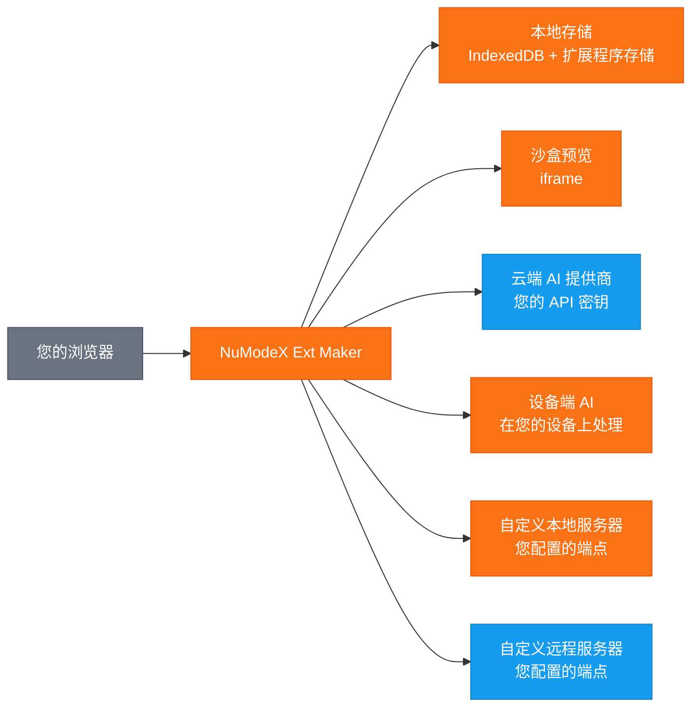

[English](README.md) | [日本語](README.ja.md) | [Español](README.es.md) | [Français](README.fr.md) | [한국어](README.ko.md) | [Deutsch](README.de.md) | [Português](README.pt.md) | [Italiano](README.it.md)

# NuModeX Ext Maker

 -green.svg)      

使用 AI 构建 Manifest V3 浏览器扩展程序和静态网站。

SoraVantia GK 出品的 Manifest V3 浏览器扩展程序和静态网站构建器。无需登录、无需订阅、无后端。使用云端 AI 提供商、设备端模型或您自己的本地/远程 AI 服务器。

**网站：** https://numodex.com/numodexextmaker

**Firefox Add-ons:** https://addons.mozilla.org/firefox/addon/numodex-ext-maker/

## 功能

- AI 驱动的浏览器扩展程序生成（Manifest V3）
- 多提供商支持。使用您自己的 Google、OpenAI 或 Anthropic API 密钥
- 设备端 AI 模型。无需 API 密钥即可使用浏览器提供的 AI
- 自定义模型支持。连接到任何支持 /v1/chat/completions API 的本地或远程 AI 服务器
- 具有完整对话历史的对话式聊天界面
- 文本和图片提示支持
- AI 驱动的编辑。用单个提示编辑单个文件、添加新文件或改进整个扩展程序
- 使用内联编辑器手动编辑代码
- AI 编辑撤销支持
- 查看更改。在统一视图或并排视图中比较前后差异
- 实时预览。在沙盒 iframe 中查看生成的扩展程序的可视化预览
- 一键复制文件内容到剪贴板
- 内置语法高亮代码查看器和文件树
- 一键 ZIP 下载生成的扩展程序
- 多项目支持。创建、重命名、切换和删除项目
- 自动命名。项目从生成的扩展程序的 manifest 自动命名
- 项目持久化。您的工作自动保存并在重新打开时恢复
- 键盘快捷键。Enter 发送，Shift+Enter 换行，Ctrl/Cmd+Enter 构建扩展程序，Ctrl/Cmd+Shift+Enter 构建网站
- 系统深色模式检测。首次启动时自动匹配操作系统偏好
- 深色模式切换用于手动切换
- 多浏览器支持。为 Chrome、Edge 和 Firefox 构建
- 9 种语言：英语、日语、西班牙语、法语、韩语、中文、德语、葡萄牙语、意大利语
- 内置帮助指南和应用内服务条款
- 无需账户。完全在浏览器中运行
- 使用 AI 构建静态网站（HTML/CSS/JS）- 相同的聊天式工作流，不同的输出
- 可用于个人和商业用途

## 数据流

> 🟠 橙色 = 留在您的设备上 | 🔵 蓝色 = 使用您的 API 密钥传输 | SoraVantia GK 不在数据路径中。

## 开始使用

1. 接受服务条款（首次启动时）。
2. 在设置中输入您的云端 AI 提供商的 API 密钥。
3. 选择模型，描述您想要构建的内容，然后点击"构建扩展程序"或"构建网站"。
4. 将生成的文件下载为 ZIP 并加载到浏览器中。

有关详细的设置说明、设备端 AI 配置、故障排除和提示，请参阅[入门指南](getting-started-zh-3-26-2026.md)。

## API 密钥

使用此扩展程序需要您自己的 API 密钥。从您的云提供商获取。API 密钥本地存储在您的浏览器中，永远不会发送给 SoraVantia GK 或任何第三方。

## 语言

英语、日语、西班牙语、法语、韩语、中文、德语、葡萄牙语、意大利语

## 许可证

NuModeX Ext Maker 是源代码公开的，根据 Business Source License 1.1（BSL 1.1）进行许可。源代码在项目存储库中公开提供。

**Business Source License 1.1** 源代码根据 BSL 1.1 提供使用。您可以为个人或内部业务目的使用、修改和创建衍生作品。2030 年 3 月 23 日，许可证自动转换为 Apache License, Version 2.0。完整文本请参阅 [LICENSE](LICENSE)。

**附加使用授权** 您可以对许可作品进行生产使用，前提是您的使用不包括将许可作品（或任何衍生作品）再分发至任何浏览器扩展程序市场。

### 您可以做的

- 为个人或内部业务目的使用扩展程序
- 克隆存储库并自行构建或侧载扩展程序
- 为非市场用途修改源代码和创建衍生作品
- 通过浏览器扩展程序市场以外的任何渠道分发
- 研究、学习和参考源代码
- 直接向用户侧载或部署（例如企业部署）
- 通过 Issues 报告错误、请求功能和发送建议
- 为原始项目做贡献

### 需要许可的

- 发布到 Chrome Web Store、Firefox Add-ons、Edge Add-ons、Safari Extensions、Naver Whale Store 或任何浏览器扩展程序市场

### 变更日期

2030 年 3 月 23 日，许可作品将自动根据 Apache License, Version 2.0 提供。

如需市场许可证或商务咨询，请联系：numodex@soravantia.com

## 法律声明

安装或使用 NuModeX Ext Maker，即表示您同意[最终用户许可协议](eula-zh-v2.5.md)和[隐私政策](privacy-policy-zh-v2.5.md)。
本项目目前不接受拉取请求。请使用 Issues 报告错误和请求功能。这可能在未来有所改变。

## 第三方声明

NuModeX Ext Maker 与第三方 AI 服务集成。SoraVantia GK 与任何第三方 AI 提供商之间不存在附属、认可或官方关系。所有产品名称、商标和注册商标均为其各自所有者的财产。本项目中对它们的提及仅用于识别目的。SoraVantia GK 可以随时添加、删除或更改对 AI 提供商和模型的支持。

## 第三方许可证

详情请参阅 [THIRD-PARTY-LICENSES](THIRD-PARTY-LICENSES)。

## 版权

Copyright 2026 SoraVantia GK. All rights reserved.
